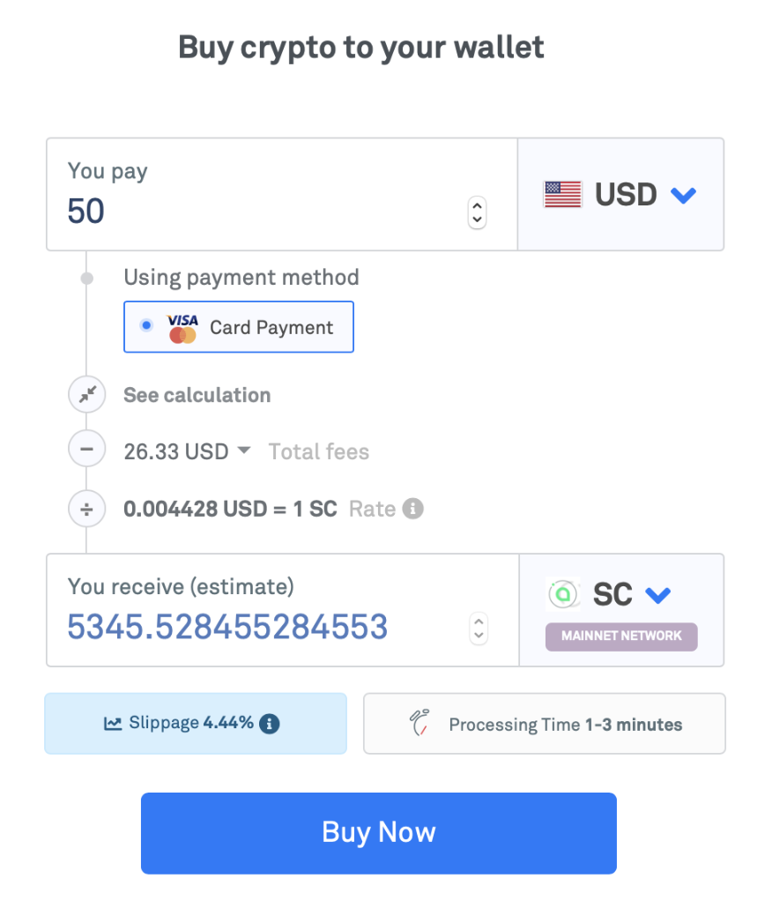
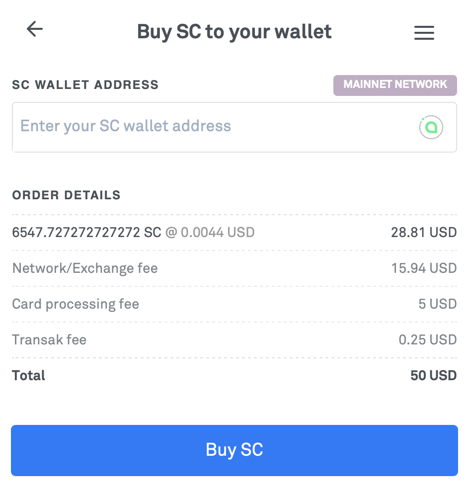

# How to buy Siacoins

Whether you want to upload files to the decentralized cloud or lend your extra storage space to the network, you need Siacoins to use Sia. Siacoins can be sent to you once you make a Sia address, or you can mine them. Otherwise, you’ll need to buy them.

Siacoins are available on a number of major exchanges like Binance, Bittrex, Kraken, Upbit, Poloniex, Huobi, OKex, and HitBTC. Get the full list [here](https://airtable.com/shrq4MSLNxinvnaR7).

Some exchanges support direct fiat \(local currency\) to Siacoin purchases, but others require you to buy Bitcoins, Ethereum, or other crypto to make your purchase. We’ll walk you through the process of buying your first Siacoins.

### What is KYC?

No, this isn't chicken related. KYC stands for Know Your Customer, and is a set of identity verification rules that most exchanges have to follow to abide with local laws. This might include submitting scans of state or federal ID, or sending in your government ID numbers like a Social Security Number if you live in the US. You'll be guided through whatever KYC process your exchange of choice has.

### Buy SC from an exchange

This option gets you the best prices, but has a fairly intense on-ramp for a new user.

This example will use [Bittrex](https://bittrex.com/), a US-based exchange that allows you to trade regular US dollars \(USD\), BTC, ETH, or USDT for Siacoins. But the general process will be similar no matter which exchange you use.

* [Sign up for an account](https://bittrex.zendesk.com/hc/en-us/articles/115005329167-Creating-a-Bittrex-Account-and-Performing-Verification) with Bittrex. The process is simple, but fairly long and requires identity verification along the way.
* Once signed up, find the market you’re interested in. Purchase directly with [USD](https://bittrex.com/Market/Index?MarketName=USD-SC) or [Bitcoin](https://bittrex.com/Market/Index?MarketName=BTC-SC).
* Make a trade by specifying how many Siacoins you want to buy, and at what price.


If this is your first time purchasing crypto, start with a small amount until you’re comfortable with it.


* Now you have the Siacoins in your Bittrex wallet, but exchange wallets aren’t a good place to store crypto, and you can’t use it for its intended purpose - using Sia.
* Transfer to your Sia wallet by [making a Sia address]() and then sending to it from Bittrex.

### Buy SC using Transak

Transak offers incredibly easy crypto purchasing using just your debit or credit card, but you pay extra fees and there are minimum purchase amounts that might be higher than what you need.

Visit [transak.com](https://transak.com), tell them how much of your local currency you want to spend, and they'll tell you how much SC you can get.

Click **Buy Now**.

Then enter in your SC address [that you made](../your-sia-wallet/how-to-make-a-sia-address.md), and click **Buy Now** again to proceed through transaction process.

