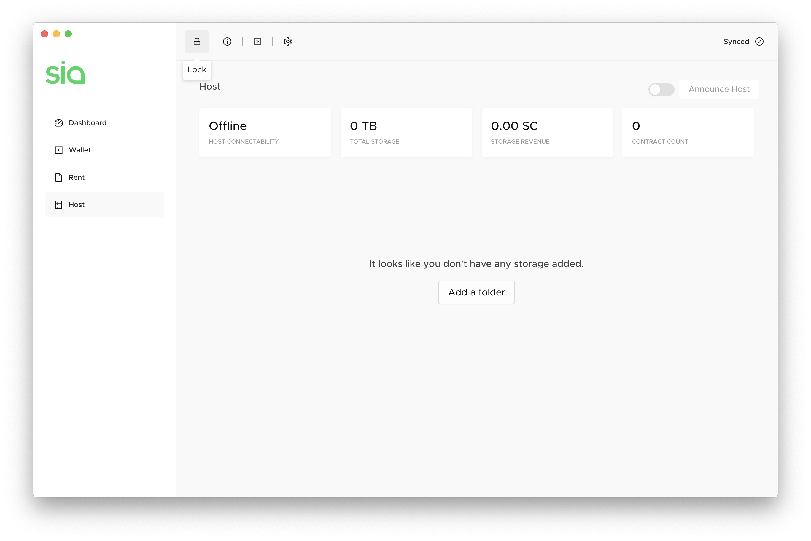
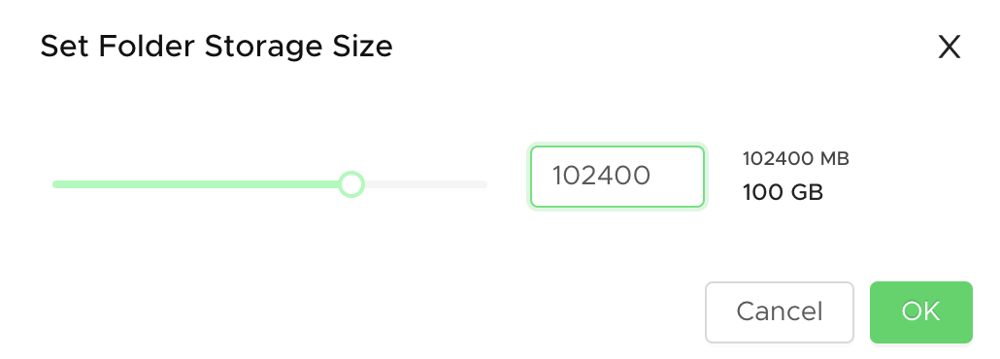
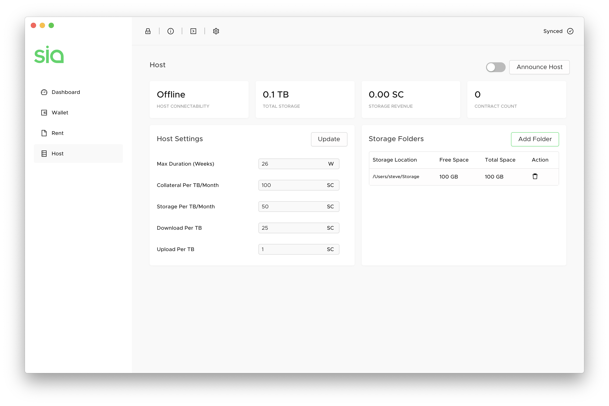
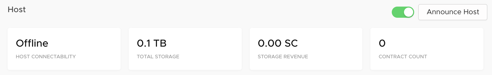

# How to host on Sia

This section takes you through how to actually set up a Sia host.

## Thing you'll need

Not meeting these requirements can have a range of effects: you may be unable to host, you may not receive any storage contracts from renters, or you may even risk losing your own Siacoins as a penalty. Hosting is a serious commitment. If you're going to do it, do it right.

* **A reliable and stable setup:** You need a computer, internet connection, and electricity that you can trust. Hosts are required to be online nearly 100% of the time or face financial penalties.
* **Sia Prerequisites:** Make sure your computer meets the Sia requirements
  * CPU: Sia does not require special CPU considerations
  * RAM: 8 GB recommended
  * SSD: 40 GB recommended \(keep an eye on your consensus size!\)
  * Create a Sia wallet
  * [Get Siacoins](../get-started-with-sia/how-to-buy-siacoins.md)
* **Storage space:** Spare hard drive space to rent out, ideally greater than 4 TB.

## The process

Open Sia and click on the **Host** tab on the left. This is where you can configure your host settings. The first thing you do is tell Sia where your storage folder is. This is a location on the storage device you want to use for hosting.



Click **Add a folder**, then select a location. You can choose an drive \(like D:\\) to use an entire empty drive or partition, or you can pick a specific folder on a drive. Sia will create one large file in the location you select that allocates the amount of storage you choose.



Tell Sia how much space you want to allocate to hosting, in megabytes. Entering a value lower than 32 GB will provide a warning, since as a host you're graded on having a lot of available storage. Set at least 4 TB if you can. You can type in a value if you want to set a value higher than what the slider allows.

Here's some quick values you can use to get started:

* 10240 is 10 GB
* 51200 is 50 GB
* 102400 is 100 GB
* 1024000 is 1 TB
* 4096000 is 4 TB
* 10240000 is 10 TB
* 102400000 is 100 TB

## Host Settings





Measured in weeks, Max Duration determines the longest contract you'll accept. The default length during contract creation for renters is 13 weeks, so don't go lower than that or you risk not forming many contracts.



Collateral is the amount of Siacoins you're willing to lose if you end up not fulfilling your end of the contract, which is to store renter's data for the contract length while being online.

Putting up more collateral improves trust by showing you're willing to lose more money than another host. Setting this amount at 2-3 times your storage price is a good idea to maximize your host score while not losing too mucn money if your host does indeed go down.



The biggest factor in your host score, this number is how many Siacoins you are charging for 1 TB each month. The less you charge, the more positively it affects your host score. The more you charge, the more money you make. Find your balance between profitability and competitive pricing.



This is how much you charge renters for downloading data from your host.

Users who frequently download data might use a lot bandwidth, and you can charge accordingly.



This is how much you charge renters for uploading data to your host.

This is similar to download bandwidth. You pay for your bandwidth from your ISP, so you can pass that cost on to your renters.



This is the cost of creating a contract with your host.

This can only be changed in siac, or using the Terminal in Sia-UI with the command `host config mincontractprice <value>SC,` or;

`host config mincontractprice 0.3SC`



## Announce your host



Click the slider at the top of the Host window next to the Announce Host button so it appears green. This will turn on your host for accepting new storage contracts from renters. Then, unless you used DDSN in a previous step, click **Announce Host** to the Sia network so that renters can find you.

### If you signed up for a DDNS service

You need to announce your host using your [DDNS hostname](how-to-host-on-sia.md#set-up-dynamic-dns-ddns-optional) in order for it to work. You can also announce a specific IP address. Click on the **Terminal** `>` icon at the top of the Sia-UI window, and type:

`host announce [ddns hostname or ip]:9982`

substituting \[_ddns hostname or ip_\] with your unique DDNS hostname that you received from your DDNS service or the IP you want to announce. Make sure to include :9982 afterwards and without a space, as this specifies which port renters can contact you through and is the default for Sia.


Announcing your host is a transaction that will appear in your Transaction list in your wallet.


Read on for some additional important things to take care of yo get the most out of your host.

## Port Forwarding \(Required\)

The number one reason that users have issues getting their host running is port forwarding. By default, the host is on port :9982, but you should forward all ports from :9981 to :9984. You can see if your host has forwarded its port from this website: [http://canyouseeme.org/](http://canyouseeme.org/)


Be sure to not forward port 9980, as this can represent a security threat. You'll need to access your router's manual to learn how to set up port forwarding on your device.


### What each port does

* :9981 \(consensus p2p network\)
* :9982 \(renter-host-protocol-v2\)
* :9983 \(rhp-v3\)
* :9984 \(rhp-v3-websocket\)

If your port is not forwarded, it's probably because your router does not support upnp. Unfortuantely, that means you need to go into the configuration yourself and do it manually. There are some great guides to help you here: [https://portforward.com/](https://portforward.com/)

Renters know to contact your host from the network address in the host announcement. If your IP address has changed since your announcement, you will need to announce again. If you have a firewall or some networking setup that may be blocking inbound connections from the internet, you need to make sure that it allows traffic to reach the host.

Finally, if you have a dynamic IP address, you should strongly consider setting up something like DynDNS, which allows you to announce a hostname and then manages the dynamic IP address issue for you.

## Set up Dynamic DNS \(DDNS\) \(Optional\)

Most residential Internet services assign subscribers a dynamic public IP address which may change at a set duration, or when rebooting your Internet modem. This can be a problem because when running a service like a Sia host, renters find you by your public IP address. The host tracks your current IP address and automatically re-announces every time that the IP address changes. If you have manually set the host's net address \(which can be IPv4, IPv6, or a full hostname like myhost.sia.tech\), then the host will stop tracking your IP address and instead just use the one you have set manually.

You can go a step further and mitigate this issue by signing up for a Dynamic DNS \(DDNS\) service. If you have a static public IP address, you don't need to worry about this step. If you're not sure whether or not you have a static IP address, it won't hurt to set up DDNS anyway.

DDNS services work by assigning you a subdomain or URL, and having you run a small program or script on a device on your network - your Sia host computer will work fine. Some routers also have built-in DDNS support for certain DDNS services. When your public IP address changes, the DDNS client detects the change and updates your DDNS subdomain or URL with your new IP address. You can use your DDNS address to announce your Sia host, and renters will always be able to find you as long as you have DDNS set up and the IP update software running.

There are several free DDNS services available, such as [NoIP.com](https://www.noip.com/remote-access), [Afraid.org](https://freedns.afraid.org/), or [Dynu.com](https://www.dynu.com/DynamicDNS). Visit any of these, or search for your own free DDNS service, and follow the instructions to set up your DDNS hostname and install IP update software. Note that some free services may require you to confirm you're still using your DDNS account with them by requiring you to do something like click a link in an email once a month or so - make sure you watch for this, as you could lose your DDNS hostname and make your Sia host unconnectable if you don't. When you're done, you should have a DDNS URL such as `mysiahost.noip.com` which you can use in the next step to announce your host with.

## Auto-unlock your Sia wallet \(Optional\)

What happens if your computer shuts down and you're not there to turn it back on? Setting your computer to automatically reboot, start Sia, and unlock your wallet can get you back up and running to minimize downtime.

Read [this page](../your-sia-wallet/for-advanced-users/how-to-automatically-restart-and-unlock-sia.md) to set it up.

## Check host configuration \(Optional\)

Once you're set up, you can be proactive about making sure everything is set up right. Use the [SiaCentral Host Troubleshooter](https://troubleshoot.siacentral.com) to check your host confirguration and make sure it can form contracts. Change your host address if necessary to your host's actual public IP or DDNS address.

If SiaCentral discovers issues when connecting to your host, wait an hour or two and try again - the announcement can take a little while to reach the Sia network.

## Set up host metadata backups \(Recommended\)

Sia keeps data pertaining to your hosting operation in two places:

* The storage folders you're renting out, where uploaded renter data is stored 
* Internal host metadata files which keep track of your contracts with renters and what's where in your storage folders 

The first type of data, uploaded renter data, isn't very practical to back up unless you have additional hard drives laying around with capacity equivalent to what you're selling on Sia. In that case, you'd be better off setting up a mirrored volume with multiple disks to prevent data loss if a drive fails.

The second type of data, internal host metadata, is equally important. Sia installations have been known to corrupt this data if a host does not shut down gracefully \(i.e. a power outage or crash\), and in rare cases Sia itself can corrupt this data at no fault of the user. Without this metadata, your host cannot operate, and it is equivalent to losing all of your renter's data on all storage folders. This would result in the loss of all your risked collateral for your host. For this reason, you can see why it might be important to back the metadata up regularly. Even if you restore a copy of the metadata which is a few days old, you only stand to lose collateral for data uploaded to your host over those few days.

Host metadata is located in the `/host` folder in Sia's internal data files, which can be found in the Sia-UI by clicking the **About \(i\) icon &gt; Open Data Folder**or in these locations:

* **Linux:** `$HOME/.config/Sia-UI/sia/`
* **Mac:** `$HOME/Library/Application Support/Sia-UI/sia/`
* **Windows:** `%APPDATA%\Sia-UI\sia\`

It is recommended to set up a backup schedule to regularly back up your `/host` folder so that you do not risk losing your hosting operation entirely in the event that your computer or Sia crashes, or the data is randomly corrupted. You can do this by writing a simple backup script, by using built-in backup tools in [Windows](https://support.microsoft.com/en-us/help/17127/windows-back-up-restore) and [macOS](https://support.apple.com/mac-backup), or by using third-party tools in [Linux](https://www.tecmint.com/linux-system-backup-tools/).

## Advanced Monitoring \(Optional\)

A detailed itemization of earned coins and expected revenues, together with more parameters and statistics, can be checked with the command `siac host -v` in the Terminal. This is an example of the report:

```go
General Info:
    Connectability Status: Host appears to be working.
    Version:               1.5.3

Host Internal Settings:
    acceptingcontracts:   Yes
    maxdownloadbatchsize: 17.83 MB
    maxduration:          26 Weeks
    maxrevisebatchsize:   17.83 MB
    netaddress:           xx.xxx.xxx.xx:9982 (automatically determined)
    windowsize:           24 Hours

    collateral:       150 SC / TB / Month
    collateralbudget: 100 KS
    maxcollateral:    5 KS Per Contract

    minbaserpcprice:           100 nS
    mincontractprice:          50 mS
    mindownloadbandwidthprice: 25 SC / TB
    minsectoraccessprice:      2 uS
    minstorageprice:           50 SC / TB / Month
    minuploadbandwidthprice:   1 SC / TB

    ephemeralaccountexpiry:     604800s
    maxephemeralaccountbalance: 1 SC
    maxephemeralaccountrisk:    5 SC

    registrysize:       0  B
    customregistrypath: 

Host Financials:
    Contract Count:               1199
    Transaction Fee Compensation: 426 SC
    Potential Fee Compensation:   3.543 KS
    Transaction Fee Expenses:     0 H

    Storage Revenue:           193.2 SC
    Potential Storage Revenue: 441.9 SC

    Locked Collateral: 81.59 KS
    Risked Collateral: 1.385 KS
    Lost Collateral:   0 H

    Download Revenue:           23.58 mS
    Potential Download Revenue: 3.186 SC
    Upload Revenue:             1.708 SC
    Potential Upload Revenue:   12.04 SC

RPC Stats:
    Error Calls:        6125
    Unrecognized Calls: 2222
    Download Calls:     13097
    Renew Calls:        1791
    Revise Calls:       99676
    Settings Calls:     296858
    FormContract Calls: 1503

Storage Folders:
    Used    Capacity      % Used    Path
    72.592 GB    107.374 GB    67.71      /Users/Sia/Storage
```

