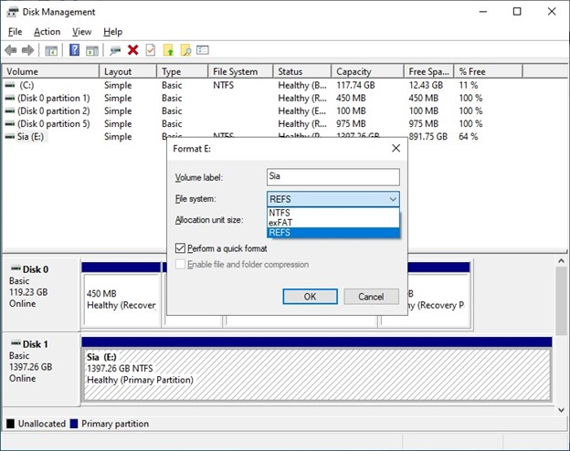
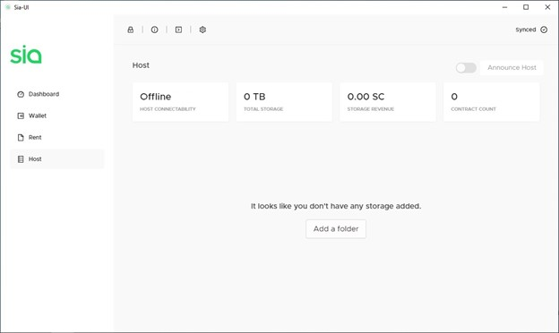
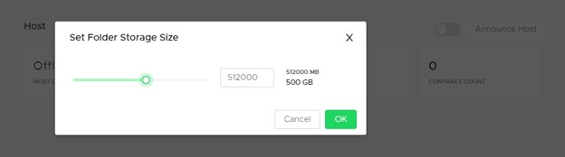
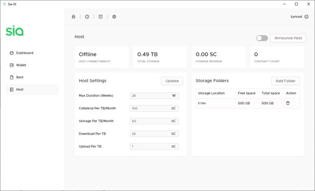
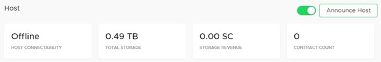

# How to Host on Sia

This section takes you through how to actually set up a Sia host.

## Things You'll Need

Not meeting these requirements can have a range of effects: you may be unable to host, you may not receive any storage contracts from renters, or you may even risk losing your own Siacoins as a penalty. Hosting is a serious commitment. If you’re going to do it, do it right.

* **A reliable and stable setup:** You need a computer, Internet connection, and electricity that you can trust. Hosts are required to be online nearly 100% of the time or face financial penalties.
* **Sia Prerequisites:** Make sure your computer meets the Sia requirements
  * CPU: A minimum of a quad-core CPU is recommended. A weak CPU may become a bottleneck if your host becomes very popular with the renters, and they start uploading or downloading a lot of data to or from your host.
  * RAM: 8 GB is a minimum, although your host will likely run out of memory under load; 16 GB, or more, is better.
  * OS drive: An SSD with a minimum of 64 GB of free space is recommended. As of February 2022, the Sia blockchain was about 32 GB and constantly growing. You should avoid letting your OS drive run out of space to prevent corrupting your host's metadata.
  * Create a Sia wallet
  * [Get Siacoins](../get-started-with-sia/how-to-buy-siacoins.md)
* **Storage space:** Spare hard drive space to rent out, ideally greater than 4 TB. It doesn’t have to be an SSD: an HDD would do just fine and also be much cheaper.
* **Sia software:** You can choose between Sia UI \(GUI\) and Sia Client, download it [here](https://sia.tech/get-started).

## Preparing Your Storage Drive\(s\) \(Windows Only, Optional\)

The NTFS file system of Windows does not support sparse files, which causes downtime when adding large \(several TB\) storage folders. You can format your storage drive using ReFS before adding it to Sia to avoid this downtime.

Unfortunately, ReFS is not available on all Windows releases. It is currently available on Windows 10 Server, Windows 10 Enterprise, and Windows 10 Pro for Workstations. Of these, Windows 10 Pro for Workstations is the most available solution: it’s quite easy to upgrade from Windows 10 Pro.

Here is how you can take advantage of ReFS:

1.	Right-click on your Windows icon and select Disk Management.
2.	Create an NTFS partition on your new drive \(if this is a new drive\).
3.	Convert your NTFS partition into ReFS.

## Disabling Automatic Updates \(Windows Only, Optional\)

Windows updates often bring important security improvements, but if they happen when Windows wants it, and not you, it becomes a nightmare. Your PC can reboot without you knowing it, or the new software may decide that Sia is a virus and remove it. So, it is better to disable automatic updates.

However, it’s not as easy as it sounds. You can stop the Windows Update service, but it will start again after a reboot. The solution is to edit the Group Policy.

1.	Right-click on your **Windows** icon and select **Run**.
2.	Enter `gpedit.msc` and click **OK**.
3.	Go to **Computer Configuration > Administrative Templates > Windows Components > Windows Update**.
4.	Double-click on **Configure Automatic Updates** \(on the right-hand side\).
5.	Click on **Disabled**, then **Apply**, then **OK**.

## Forwarding Ports \(Required\)

Users number one issue when setting up a new host is port forwarding. To host, you should forward TCP ports `:9981` through `:9984`. You can see if your host has forwarded its port from this website: [http://canyouseeme.org/](http://canyouseeme.org/)


Do not forward port 9980, as this represents a security threat. You'll need to access your router's manual to learn how to set up port forwarding on your device.


### What Each Port Does

* :9981 \(consensus p2p network\)
* :9982 \(renter-host-protocol-v2\)
* :9983 \(rhp-v3\)
* :9984 \(rhp-v3-websocket\)

If your port is not forwarded, it's probably because your router does not support UPnP. Unfortunately, that means you need to go into the configuration yourself and do it manually. There are some great guides to help you here: [https://portforward.com/](https://portforward.com/)

Renters know to contact your host from the network address in the host announcement. If your IP address has changed since your announcement, you will need to announce again. If you have a firewall or networking setup that may block inbound internet connections, you need to make sure that it allows traffic to reach the host.

Finally, if you have a dynamic IP address, you should strongly consider setting up something like DynDNS, which allows you to announce a hostname and then manages the dynamic IP address issue for you.

## Set Up Dynamic DNS \(DDNS\) \(Optional\)

Most residential Internet services assign subscribers a dynamic public IP address which may change at a set duration, or when rebooting your Internet modem. This can be a problem because when running a service like a Sia host, renters find you by your public IP address. The host tracks your current IP address and automatically re-announces every time that the IP address changes. If you have manually set the host's net address \(which can be IPv4, IPv6, or a full hostname like `myhost.sia.tech`\), then the host will stop tracking your IP address and instead just use the one you have set manually.

You can go a step further and mitigate this issue by signing up for a Dynamic DNS \(DDNS\) service. If you have a static public IP address, you don't need to worry about this step. If you're not sure whether or not you have a static IP address, it won't hurt to set up DDNS anyway.

DDNS services work by assigning you a subdomain or URL, and having you run a small program or script on a device on your network - your Sia host computer will work fine. Some routers also have built-in DDNS support for certain DDNS services. When your public IP address changes, the DDNS client detects the change and updates your DDNS subdomain or URL with your new IP address. You can use your DDNS address to announce your Sia host, and renters will always be able to find you as long as you have DDNS set up and the IP update software running.

There are several free DDNS services available, such as [NoIP.com](https://www.noip.com/remote-access), [Afraid.org](https://freedns.afraid.org/), or [Dynu.com](https://www.dynu.com/DynamicDNS). Visit any of these, or search for your own free DDNS service, and follow the instructions to set up your DDNS hostname and install IP update software. Note that some free services may require you to confirm you're still using your DDNS account with them by requiring you to do something like click a link in an email once a month or so - make sure you watch for this, as you could lose your DDNS hostname and make your Sia host unconnectable if you don't. When you're done, you should have a DDNS URL such as `mysiahost.ddns.net` which you can use in the next step to announce your host with.

## The Process

The process described below is specific to Sia UI. If you prefer to set up your host using command line only, [here](https://sky-guide.hns.siasky.net/guides/sia/linux-hosting.html) is a guide for Ubuntu.

Open Sia and click on the **Host** tab on the left. This is where you can configure your host settings. The first thing you do is tell Sia where your storage folder is. This is a location on the storage device you want to use for hosting.

Click **Add a folder**, then select a location. You can choose a drive \(like D:\\\\\) to use an entire empty drive or partition, or you can pick a specific folder on a drive. Sia will create one large file in the location you select that allocates the amount of storage you choose.

Tell Sia how much space you want to allocate to hosting, in megabytes. Entering a value lower than 32 GB will provide a warning since as a host you're graded on having a lot of available storage. Set at least 4 TB if you can. You can type in a value if you want to set a value higher than what the slider allows.

## Host Settings

### Max Duration

Measured in weeks, Max Duration determines the longest contract you'll accept. The default length during contract creation for renters is 13 weeks, so don't go lower than that or you risk not forming many contracts.

This can also be changed in `siac` or using Sia-UI Terminal with the command `host config maxduration <value>`, e.g.

`host config maxduration 26w`

### Collateral per TB/Month

Collateral is the amount of Siacoins you’re willing to lose if you end up not fulfilling your end of the contract, which is to store the renter’s data for the contract length while being online.

Putting up more collateral improves trust by showing you’re willing to lose more money than another host. Setting this amount at 2-3 times your storage price is a good idea to maximize your host score while not losing too much money if your host does indeed go down.

This can also be changed in `siac` or using Sia-UI Terminal with the command `host config collateral <value>`, e.g.

`host config collateral 100SC`

### Storage per TB/Month

The biggest factor in your host score, this number is how many Siacoins you are charging for 1 TB each month. The less you charge, the more positively it affects your host score. The more you charge, the more money you make. Find your balance between profitability and competitive pricing.

This can also be changed in `siac` or using Sia-UI Terminal with the command `host config minstorageprice <value>`, e.g.

`host config minstorageprice 50SC`


Please note that some renters have limited their maximum storage pricing.


### Download per TB

This is how much you charge renters for downloading data from your host.

Users who frequently download data might use a lot of bandwidth, and you can charge accordingly.

This can also be changed in `siac` or using Sia-UI Terminal with the command `host config mindownloadbandwidthprice <value>`, e.g.

`host config mindownloadbandwidthprice 25SC`

### Upload per TB

This is how much you charge renters for uploading data to your host.

This is similar to download bandwidth. You pay for your bandwidth from your ISP, so you can pass that cost on to your renters.

This can also be changed in `siac` or using Sia-UI Terminal with the command `host config minuploadbandwidthprice <value>`, e.g.

`host config minuploadbandwidthprice 1SC`

### Contract Fee

This is the cost of creating a contract with your host.

This can only be changed in `siac`, or using the Terminal in Sia-UI with the command `host config mincontractprice <value>`, e.g.

`host config mincontractprice 0.15SC`

### Maximum Collateral

This is how many Siacoins can be locked in a single contract. You may want to set this number reasonably high to form better contracts, but still low enough to prevent rapid draining of your wallet due to locked collateral. It’s best to set it to a few months worth of collateral to store 1 TB.

If your wallet balance is low, your host maximum collateral is adjusted automatically to not exceed your wallet balance.

This can only be changed in `siac`, or using the Terminal in Sia-UI with the command `host config maxcollateral <value>`, e.g.

`host config maxcollateral 300SC`

### Collateral Budget

This is how many Siacoins you are willing to lock in contracts in total. Your host will never lock more collateral than is allowed by the budget.

This can only be changed in `siac`, or using the Terminal in Sia-UI with the command `host config collateralbudget <value>`, e.g.

`host config collateralbudget 100000SC`

### Registry Size and Location

Registry is a special form of storage representing a key-value store. It’s currently used heavily by Skynet. Hosts are paid more for storing registry entries than for storing regular data.

Recommended registry size is 1 GB. However, you need to keep in mind that the registry is stored on your drive, and that used entries are loaded into RAM during the host startup. So, if you’re running low on RAM or drive space, you should consider reducing the registry size on your host.

Registry settings can only be changed in `siac` or using the Terminal in Sia-UI. For setting the registry size the command `host config registrysize <value>` is used, e.g.

`host config registrysize 1GB`

If you want to specify a different location for the registry file \(default is in your host folder\), you can use the command `host config customregistrypath <value>`, e.g.

`host config customregistrypath “D:\\Sia”`

## Announce Your Host

Click the slider at the top of the Host window next to the Announce Host button so it appears green. This will turn on your host for accepting new storage contracts from renters. Then, unless you used DDNS in a previous step, click **Announce Host** to the Sia network so that renters can find you.

### If You Signed Up for a DDNS Service

You need to announce your host using your [DDNS hostname](how-to-host-on-sia.md#set-up-dynamic-dns-ddns-optional) in order for it to work. You can also announce a specific IP address. Click on the **Terminal** `>` icon at the top of the Sia-UI window, and type:

`host announce [DDNS hostname or IP]:9982`

substituting \[_DDNS hostname or IP_\] with your unique DDNS hostname that you received from your DDNS service or the IP you want to announce. Make sure to include `:9982` afterward and without a space, as this specifies which port renters can contact you through and is the default for Sia.


Announcing your host is a transaction that will appear in your Transaction list in your wallet.


Read on for some additional important things to take care of to get the most out of your host.

## Auto-Unlock Your Sia Wallet \(Optional\)

What happens if your computer shuts down and you're not there to turn it back on? Setting your computer to automatically reboot, start Sia, and unlock your wallet can get you back up and running to minimize downtime.

Read [this page](../your-sia-wallet/for-advanced-users/how-to-automatically-restart-and-unlock-sia.md) to set it up.

## Check Host Configuration \(Optional\)

Once you are set up, you can be proactive about making sure everything is set up correctly. Use the [Sia Central Host Troubleshooter](https://troubleshoot.siacentral.com) to check your host configuration and make sure it can form contracts. Change your host address if necessary to your host's actual public IP or DDNS address.

If Sia Central discovers issues when connecting to your host, wait an hour or two and try again - the announcement can take a little while to reach the Sia network.

## Set Up Host Metadata Backups \(Recommended\)

Sia keeps data pertaining to your hosting operation in two places:

* The storage folders you're renting out, where uploaded renter data is stored 
* Internal host metadata files that keep track of your contracts with renters and what's where in your storage folders 

The first type of data, uploaded renter data, isn't very practical to back up unless you have additional hard drives lying around with a capacity equivalent to what you're selling on Sia. In that case, you'd be better off setting up a mirrored volume with multiple disks to prevent data loss if a drive fails.

The second type of data, internal host metadata, is equally important. In rare instances, users have experienced data corruption if the host was not shut down gracefully \(i.e., a power outage or crash\). Without this metadata, your host cannot operate. It is equivalent to losing all of your renter's data on all storage folders, resulting in losing your risked collateral. For this reason, it is essential to store the host's metadata redundantly \(i.e., RAID1\) or regularly back it up. Even if you restore a copy of the metadata which is a few days old, you only stand to lose collateral for data uploaded to your host over those few days.

Host metadata is located in the `host` folder in Sia's internal data files, which can be found in the Sia-UI by clicking the **About \(i\) icon &gt; Open Data Folder** or in these locations:

* **Linux:** `$HOME/.config/Sia-UI/sia/`
* **Mac:** `$HOME/Library/Application Support/Sia-UI/sia/`
* **Windows:** `%APPDATA%\Sia-UI\sia\`

It is recommended to set up a backup schedule to regularly back up your `host` folder so that you do not risk losing your hosting operation entirely in the event that your computer or Sia crashes or the data is randomly corrupted. You can do this by writing a simple backup script, by using built-in backup tools in [Windows](https://support.microsoft.com/en-us/help/17127/windows-back-up-restore) and [macOS](https://support.apple.com/mac-backup), or by using third-party tools in [Linux](https://www.tecmint.com/linux-system-backup-tools/).

In addition, it is recommended to backup your `siamux` folder located in the same place as your `host` folder. This folder keeps your host’s public key, which uniquely identifies your host on Sia network. It’s sufficient to back this folder up just once.

## Advanced Monitoring \(Optional\)

A detailed itemization of earned coins and expected revenues, together with more parameters and statistics, can be checked with the command `siac host -v` in the Terminal.

In the output of the command `siac host -v` you can see some strange units together with those you know already. Below is some explanation. You can also use these units when changing your host’s settings in the Terminal.

* **Currency units.** You already know SC, which equals to 1 Siacoin. Here are some other units which are used by Sia:
  * 1 MS = 1,000,000 SC
  * 1 KS = 1,000 SC
  *	1 mS = 0.001 SC
  *	1 uS = 0.000,001 SC
  *	1 nS = 0.000,000,001 SC
  *	1 H \(Hasting\) is the smallest currency unit in Sia and equals to 1E-24 SC
* **Duration units**
  * blocks \(b\)
  *	hours \(h\); 1 hour is approximately 6 blocks
  *	days \(d\); 1 day is 144 blocks
  *	weeks \(w\); 1 week is 1008 blocks
