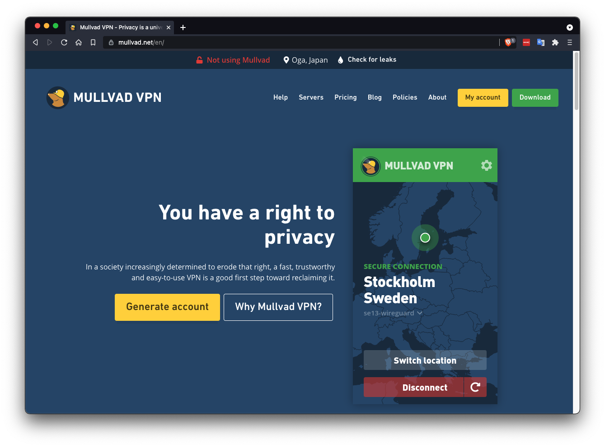
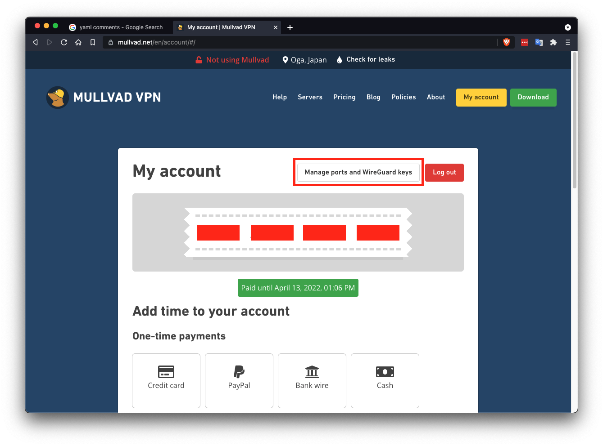
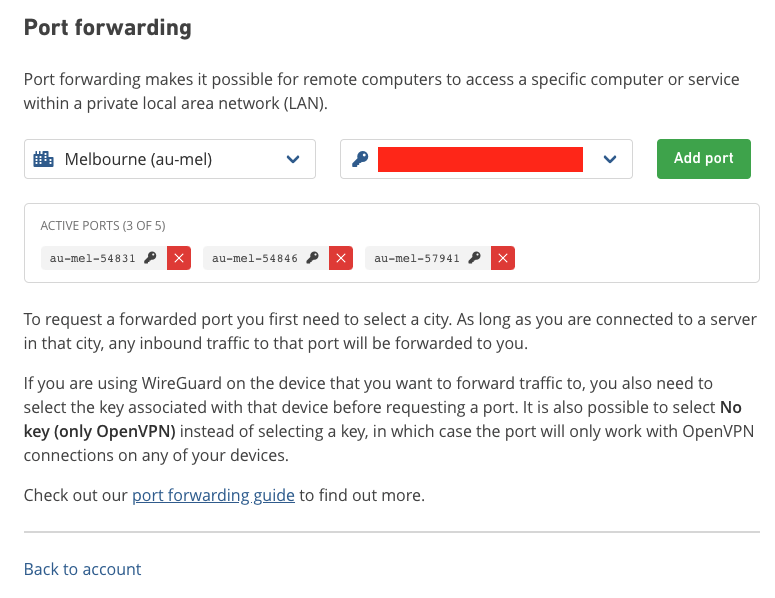

## Anonymous Hosting (Advanced)

Sia hosts are running a public service that is constantly connecting to unknown users all over the world. Opening up your network to these peers increases your attack surface and decreases your anonymity. By routing Sia's traffic through a VPN you can safeguard your home network while still earning Siacoin as a host and providing storage to the network. In this guide we will do the following:

1. Setup Mullvad using Wireguard and forward ports for Sia to use.
2. Setup DuckDNS, a free dynamic DNS to update your host's IP address when it changes
3. Setup and configure a new host
4. Test that the host is working correctly

WireGuard is a fast and secure alternative to OpenVPN. Its codebase is relatively small, which means it's more auditable for security and it's often faster.

Mullvad is very easy to set up, supports WireGuard, and allows configuring up to 5 forwarded ports. Although it is not free, it's not very expensive and allows for multiple simultaneous connections. They do not require an email address to register an account and allow payment in crypto.

DuckDNS is one of many free dynamic DNS services, they are extremely easy to setup and integrate and have docker support. Other providers, like NoIP, would also work.

By running everything in containers we can route all host traffic through the VPN without affecting the rest of the machine's traffic.

#### Prerequisites

+ [Docker](https://docs.docker.com/get-docker/)
+ [Docker compose](https://docs.docker.com/compose/)
+ Linux

## Setup a Mullvad Account



1. Click "Generate account" to generate a new account
2. A 12 digit account number will be generated for you, write this down and keep it safe. There is no recovery if you lose it

After you have created an account and added time to it, you will need to generate a Wireguard config to connect to the service.



1. Click the "Manage ports and WireGuard keys" button
2. Click the "Wireguard configuration file" link on the next page

### Generate a WireGuard config

Follow the 4 steps on the config generator to create a new WireGuard config.
1. Select "Linux" for "Choose your platform"
2. Click the "Generate key" button to generate a new key
3. Select a server location, for this guide I've selected au3-wireguard
4. If your ISP does not support IPv6, choose "Only IPv4" for "Tunnel Traffic" under "Advanced settings" 
5. In the last step you will be able to download your config file, `mlvd-*.conf`, you will need this later.


### Forward Ports
The last thing to configure with the VPN is ports that Sia will use to communicate. Select the city and public key that you configured in your WireGuard config, then click the "Add port" button three times. You will see your assigned ports in the "Active Ports" section. In the example my ports are 	`54831`, `54846` and `57941`, yours will be different.



## Setup DuckDNS
First sign in to the DuckDNS website using one of the available providers. Afterwards you can generate a new domain that will automatically update to point to your VPN IP. Note your token and subdomain, you will need them later.


## Docker Compose
Docker compose is a tool designed to make orchestrating multiple containers simpler. A compose file is used to define a set of services that can be started, stopped, and updated with a single command. There are some adjustments to the below file, save it as `host.yml`. Rename the `mlvd-*.conf` to `wg0.conf` and put it in a directory by itself: `/home/ubuntu/docker/wireguard/wg0.conf` as an example.

```yml
version: '3.7'
services:
  wireguard:
    image: ghcr.io/linuxserver/wireguard
    restart: unless-stopped
    networks:
      - private_host
    volumes:
	  # move the config directory from /home/ubuntu/docker/wireguard to
	  # somewhere appropriate for your server
      - '/home/ubuntu/docker/wireguard:/config' 
      - '/lib/modules:/lib/modules:ro'
    environment:
      - PUID=1000
      - PGID=1000
    ports:
      - 127.0.0.1:9980:9980
    cap_add:
      - NET_ADMIN
      - SYS_MODULE
    sysctls:
      - net.ipv4.conf.all.src_valid_mark=1
  duckdns:
    image: ghcr.io/linuxserver/duckdns
    network_mode: service:wireguard
	depends_on:
      - wireguard
    environment:
      - PUID=1000
      - PGID=1000
      - TZ=America/Chicago
	  # adjust the subdomain to match the subdomain you chose on duckdns.org
      - SUBDOMAINS=anonhosttest.duckdns.org
	  # replace this token with your token from duckdns.org
      - TOKEN=00000000-0000-0000-0000-000000000000
    restart: unless-stopped
  host:
	container_name: host
    image: nebulouslabs/sia:latest
	# adjust the three ports to match the ports given to you by Mullvad
    command: -c --rpc-addr :54831 --host-addr :54846 --siamux-addr :57941
    network_mode: service:wireguard
    depends_on:
      - duckdns
      - wireguard
    environment:
	  - SIA_MODULES=gctwh
	  # change this password to something secure
	  # this is used to authenticate Sia's API
      - SIA_API_PASSWORD=asecureapipassword
	  # change the password to something secure, this is used to unlock your wallet
	  # when starting the container
      - SIA_WALLET_PASSWORD=asecurewalletpassword
    volumes:
	  # adjust the host path to somewhere approriate for your server
      - /home/ubuntu/host:/sia-data
	  # add more volumes as needed based on your host
    restart: unless-stopped

networks:
  private_host:
    driver: bridge
```

That completes all of the prerequisites, now you can start your containers with `docker-compose -f host.yml up -d`. This will orchestrate the containers, connect to the VPN, and start up the node. Now you can sync the blockchain, create a wallet, and configure your host.

You can execute commands on your host by first running `docker exec -it host ash`. This will open a new terminal session in your host's container. Then you can use `siac` to interact with your running node. For the remainder of the guide, all commands are executed within the running container.

## Setting up a new host

### Creating a Wallet
You should now create a wallet. You will need the password you set in your docker-compose file earlier. I will be using `asecurewalletpassword`. Wallet seeds should not be shared between hosts, so we will be generating a new recovery seed. When prompted type in the wallet password you chose. 

```
$ /siac wallet init -p 
```
```    
Wallet password: 
Confirm: 
Recovery seed:
sneeze toyed nerves soothe imbalance bite maps inquest obnoxious sovereign hydrogen pact quick sipped scoop language gossip acquire western dwelt hairy fossil goodbye hills dyslexic sword tossed psychic

Wallet encrypted with given password
```

A new 29 word wallet seed will be generated. Save this seed somewhere secure, if something happens to your server you will need it to recover your Siacoin.

You should now unlock your wallet. In the future, your wallet will automatically unlock when starting Sia.
```
$ /siac wallet unlock
```

The last step is to generate an address to send Siacoin to:
```sh
$ /siac wallet address
Created new address: b96540b9eb96424827fe4d65bb618201c90eb2096908442746e6f29553159b4bf70a030f8cf9
```

You can now send Siacoin to this address to fund your host, however the funds will not show up until you are fully synced. 

Hosts need Siacoin to form contracts, post collateral, and provide storage proofs. It is important to keep at least a little balance in your wallet at all times. Around $10 USD in Siacoin is enough to get started, but you may need to add more as it gets locked into storage collateral.

### Wait for Sync
Now we need to wait for our host to fully synchronize we can check progress with the following command:

```
$ /siac consensus
Synced: No
Height: 34030
Progress (estimated): 10.8%
```

### Add Storage Folders
Now you can add storage folders. **Make sure any drives are included as docker-compose volumes, otherwise you will lose data when restarting the containers.** I am adding a 1TB folder mounted at `/mnt/data`

```
$ mkdir -p /mnt/data/sia/storage01
$ /siac host folder add /mnt/data/sia/storage01 1TB
```

### Set Pricing
I am going to be setting my host's storage price to `120 SC/Tb/mo` (around $1.50 USD), download price to `300 SC/Tb` (around $3.00 USD), and collateral to `240 SC/Tb/mo` (`2x storage price`). You can see all of the configuration options by typing `siac host config --help`

```
$ /siac host config minstorageprice 85SC
$ /siac host config mindownloadbandwidthprice 170SC
$ /siac host config minuploadbandwidthprice 0H
$ /siac host config collateral 170SC
```

### Setup Host Registry (Optional)
The Skynet registry is a key value store for storing small amounts of data. The host does not have to post collateral for data stored in the registry, so there's no risk of losing money if you lose the stored data. It is completely optional to enable.

Pricing is based on your storage and bandwidth prices. Updating a registry key costs the renter 5 years of storage + bandwidth. Reading a registry entry costs the renter the equivalent of 10 years of storage + bandwidth.

The recommended registry size is 4GB, it is stored with your consensus data.

```
$ /siac host config registrysize 4GB
```

### Announcing
Now that you synced and sent some SC to your host, all that is left is to announce. We will be using the NoIP DNS we set up (`siacentral.ddns.net`) and the RHP2 port from Mullvad (`54846`). Be sure to change both of these values to match your own host.
```
$ /siac host announce "siacentral.ddns.net:54846"
```

Announcements can take between 20 minutes to an hour to be confirmed. Once your announcement is confirmed you can check your host using 
[Sia Central's Host Troubleshooter](https://troubleshoot.siacentral.com) or [SiaStat's Host Monitor](https://siastats.info/hosts)

### Using siac
`siac` is the utility used to interact with a running Sia node you can list commands available or get usage information by adding `--help` to the end of any command:
```
$ /siac wallet --help
$ /siac host --help
$ /siac host folder --help
```

### Updating Your Host
When a new version of Sia is released you can use the following commands to update:

1. `docker-compose -f host.yml pull` will download the latest images of all containers. 
2. `docker-compose -f host.yml up -d` will update all of the containers