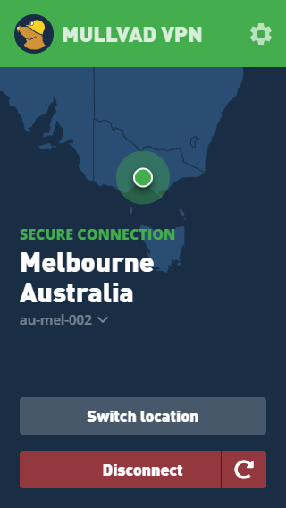
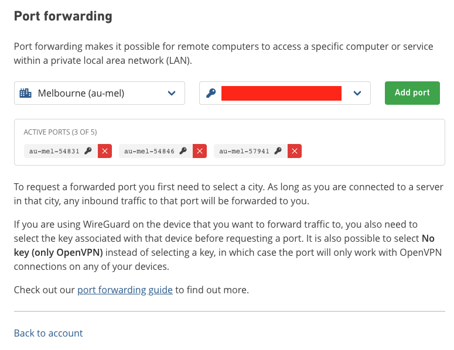
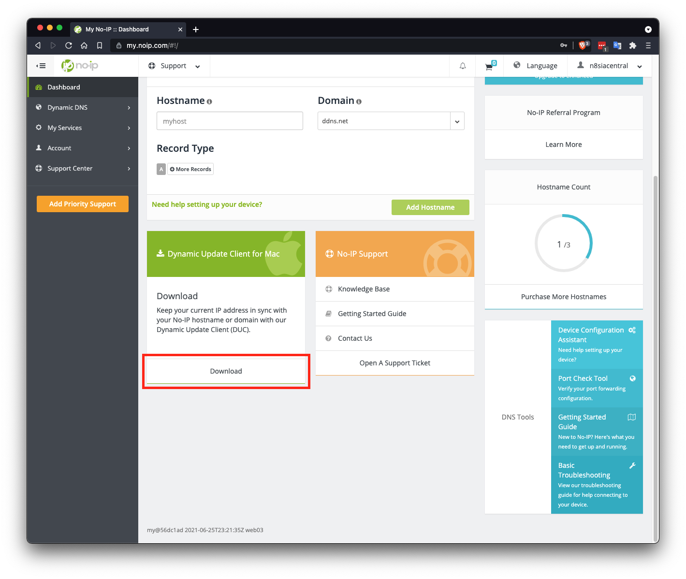
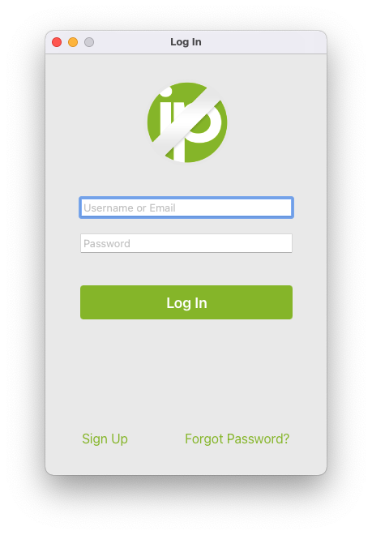
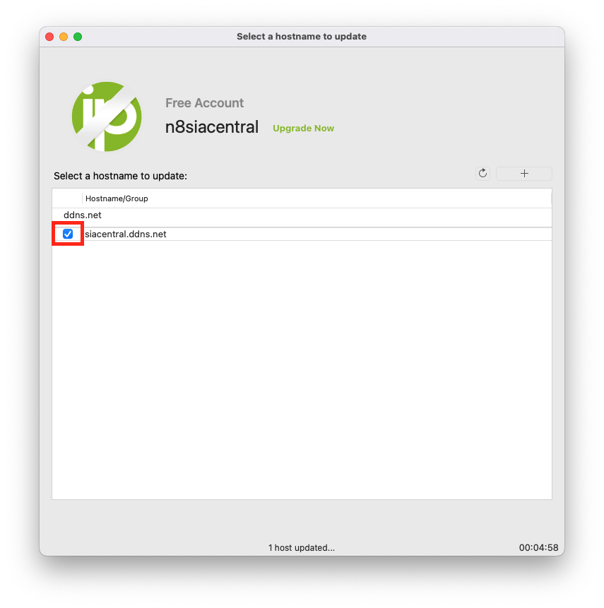
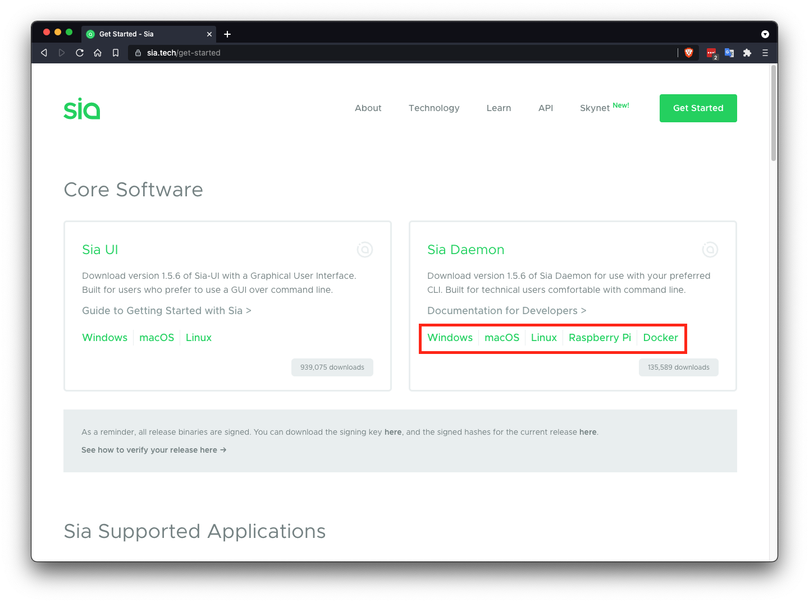
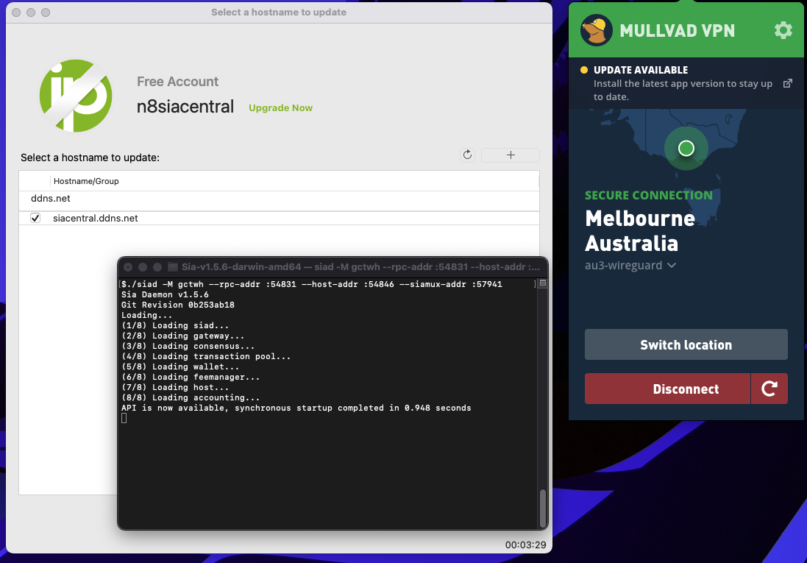
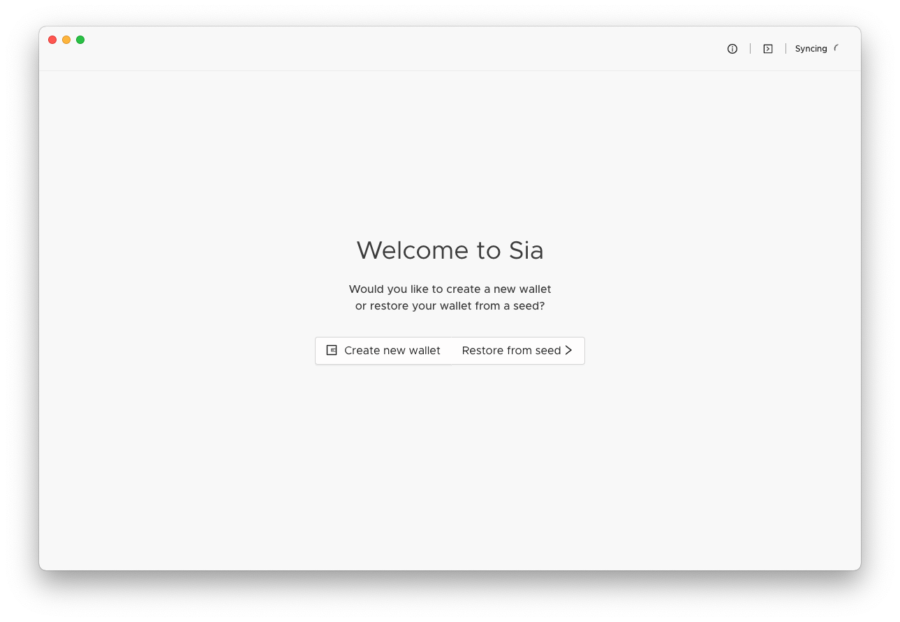
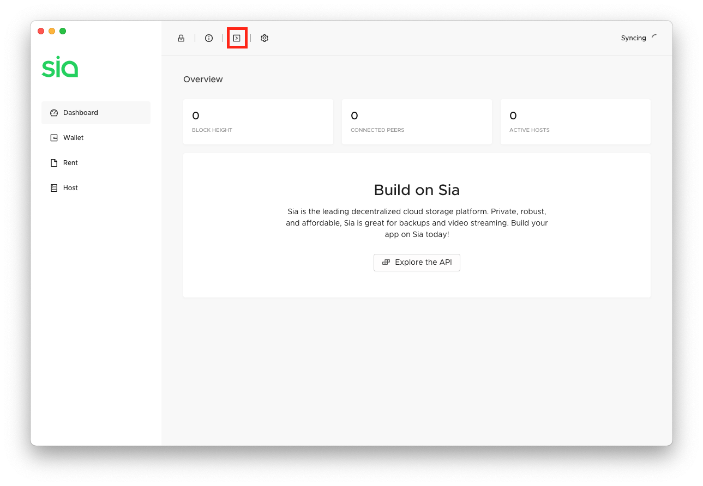
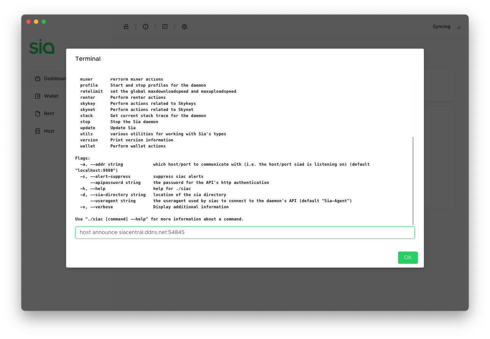

# Anonymous Hosting (Simple)

Sia hosts are running a public service that is constantly connecting to unknown users all over the world. Opening up your network to these peers increases your attack surface and decreases your anonymity. By routing Sia's traffic through a VPN you can safeguard your home network while still earning Siacoin as a host and providing storage to the network. All traffic on your machine will be routed through the VPN, ideally only do this on a dedicated hosting machine. In this guide we will do the following:

1. Setup Mullvad, a VPN provider, and forward ports for Sia to use.
2. Setup NoIP, a free dynamic DNS to update your host's IP address when it changes
3. Start siad and connect to Sia-UI

WireGuard is a fast and secure alternative to OpenVPN. Its codebase is relatively small, which means it's more auditable for security and it's often faster.

Mullvad is very easy to set up, supports WireGuard, and allows configuring up to 5 forwarded ports. Although it is not free, it's not very expensive and allows for multiple simultaneous connections. They do not require an email address to register an account and allow payment in crypto.

NoIP is one of many free dynamic DNS services. They have an easy to use GUI client, but other providers, like DuckDNS, will also work.

## Setup a Mullvad Account


1. Click "Generate account" to generate a new account
2. A 12 digit account number will be generated for you, write this down and keep it safe. There is no recovery if you lose it

After you have created an account and added time to it, download the Mullvad client to connect to the vpn.




### Forward Ports
From the account page, click the "Manage ports and WireGuard keys" button. Select the public key, it's likely the latest one then select the city that you connected to in the Mullvad client. Afterwards click the "Add port" button three times to assign three ports to your connection. You will see your assigned ports in the "Active Ports" section. In the example, my ports are `54831`, `54846` and `57941`.



## Setup No-IP
First sign in or sign up on the No-IP. You can select a domain, then download the update client.



When you first start the update client you will be prompted to login with your username/password from when you registered.



After logging in you can select which domain you would like to update. After checking the box next to the domain, it will be updated every 5 minutes as long as the update client is running.



## Setting up Sia
Sia-UI does not support changing ports, you will have to use `siad` directly. You can still use Sia-UI or Host Manager to configure your host later. Install the latest version of siad by going to the official website and downloading the latest zip file of Sia Daemon for your operating system from https://sia.tech/get-started. 



After downloading unzip the downloaded file. Inside the folder you will see `siac` and `siad`. `siad` is the daemon that runs the Sia node, you will need to always keep this running. `siac` is a command line client that interacts with the running daemon allowing you to easily configure your host. 


Inside you should see `siac` and `siad`. We now need to open a command prompt or terminal in this directory. Copy the folder path in your file explorer, open up a new terminal or cmd window and type `cd`, a space, then paste your copied directory path. Now take your three ports from Mullvad (mine are `54831`, `54846` and `57941`) and use them in the following command to start Sia. Make sure Mullvad is connected to the proper location and NoIP is running beforehand.

```
$ /siad -M gctwh --rpc-addr :54831 --host-addr :54846 --siamux-addr :57941
```

At this point you should have three applications running. All three of these applications must be kept open for the host to function properly.



## Connecting to Sia-UI
You can now connect your running Sia node to Sia-UI to make creating a wallet and setting prices easier. 



When you first start Sia-UI you should immediately see the "Welcome" screen and be prompted to create a new wallet. After creating your wallet you will need to wait for Sia to fully sync before continuing. You will also need a little bit of Siacoin to fund your host.

### Announcing
Now that you synced and sent some SC to your host, all that is left is to announce. We will be using the NoIP DNS we set up (`siacentral.ddns.net`) and the RHP2 port from Mullvad (`54846`). Be sure to change both of these values to match your own assigned ports. Click the terminal button in the top right of Sia-UI:



In the box that pops up type `host announce` followed by your DNS and port eg: `host announce siacentral.ddns.net:54846` and press enter


You should receive a message that your announcement was successful. Announcements can take between 20 minutes to an hour to be confirmed. Once your announcement is confirmed you can check your host using 
[Sia Central's Host Troubleshooter](https://troubleshoot.siacentral.com) or [SiaStat's Host Monitor](https://siastats.info/hosts)

## Updating Your Host
It is important to keep your host up to date. To update:
1. Download and unzip the latest release from https://sia.tech/get-started
2. Stop siad using `siac stop`
3. Replace the old `siad` and `siac` binaries
4. Start `siad` using the correct command