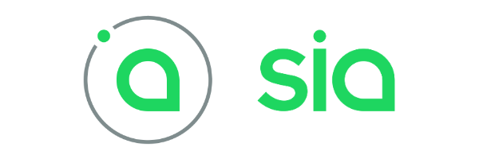
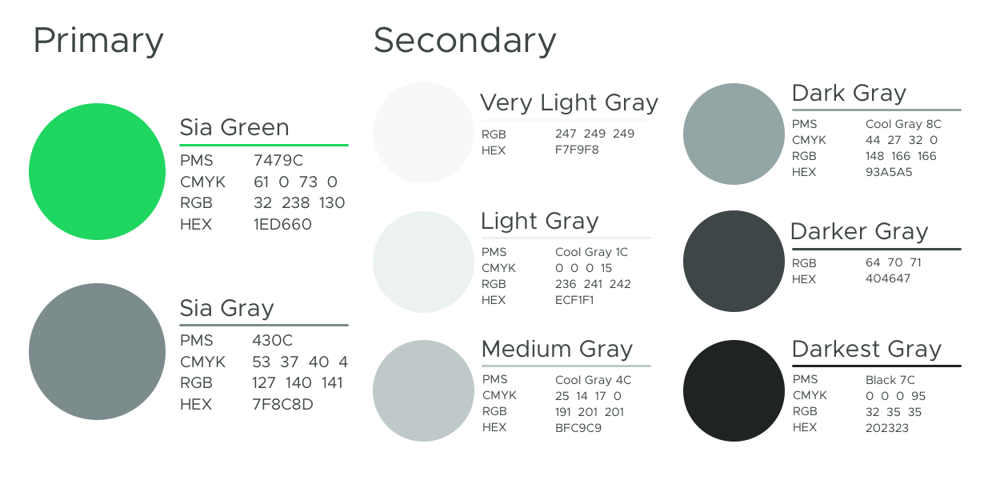

# Brand guidelines for Sia in your project or site

Community and third-party \(non-core\) projects are an essential part of the Sia ecosystem. They expand the use-cases for Sia, and improve the network with solutions we aren’t actively working on.

We want users to be able to distinguish between core and non-core projects for a number of reasons:

* Non-core projects typically involve a bit of centralization, and that’s ok. Users need choice, and centralization provides features that are much easier to implement than can be done on Sia.
* People might confuse your project with something built by the core team, and we want to make sure users know who to go to for help.
* You worked hard on your project, and we want it to stand out!

In an effort to promote these goals, please use the following as guidelines when developing your brand.

## Official Sia assets

[Get them here](https://gitlab.com/NebulousLabs/Sia/-/tree/master/doc/assets/community/sia). It includes our logo and wordmark in a variety of high-quality formats, as well as the built with Sia logo for third-party projects.

## `built with Sia`

If you are building a project featuring Sia, use the `built with Sia` logo to showcase your integration. You can drop this in the app, website, or anywhere else that makes sense.

## Naming your project

You have a lot of freedom here. Feel free to use the word “Sia” however you want in your project, with two exceptions:

* Don’t call your project “Sia”. Because that’s our name.
* Don't use the term “Sia” and then a generic term that directly relates to our business like “Cloud”, “Storage”, or "Backup".

Current examples of good naming in the community are: SiaStats, Siasync, SiaWiki, and Siamining. You know it's about Sia, and get a good idea of what specifically the project might focus on.

Just remember, if you’re trying to make a play on words, we pronounce Sia like “sigh-uh” and not “see-ya”.

You can also create a wonderfully custom name that represents you or your work. Some examples are projects like Pixeldrain, Filebase, and roadie.

## Logo and Wordmark

We’re a little more strict on this one. We own the trademark in the US for both the Sia logo and wordmark:

We’d prefer that your project not use the Sia logo or wordmark directly in any capacity, but you can style on it as long as a normal user wouldn’t confuse it for the real thing.

A good example of this is SiaStats:

The logo is similar, but is easily differentiated from the Sia logo by both the color and the design using a line graph in the center. Plus, it perfectly represents what the site is about - Sia and stats!

## Color

Sia uses a number of colors.

If you use the exact Sia logo or wordmark in any way, like to represent the fact that you integrate with Sia on your site, the image should either use our green or one of these grays. In other words, don't use our exact logo or wordmark and change the color to match your color scheme.

When designing your own logo, feel free to draw from our color palette or create your own.

We can't wait to see what you build! Be sure you let us know in [Discord](https://discord.gg/sia).

