# Using the Sia Ledger Nano S app

## What is the Ledger Nano S?

The Nano S is a hardware wallet created by Ledger. A hardware wallet stores the private keys to cryptocurrency on a separate device, making it much harder for malicious parties to steal them. In fact, the private keys never leave the Nano S itself, so they will remain secure even if the device is connected to a compromised computer. As long as you follow best practices when using your Nano S, it is virtually impossible for an attacker to steal your funds.

Hardware wallets are an important part of the crypto ecosystem, and they're one of the best ways to personally secure your coins. We're happy to be working with Ledger to offer our official Sia app for use on the Ledger Nano S.

## Things you'll need

Using Sia on the Ledger Nano S requires a few things. You will need:

* Your Ledger Nano S
* The Sia app installed on your Nano S
* v1.3.5 or later of `siac` and `siad` installed on your computer to connect to the Sia network
* The `sialedger` app on your computer to talk to the Nano S
* Familiarity with your computer's command-line interface \(CLI\).


The current process for using the Sia app is more easily followed by advanced users. If you're not comfortable using the command-line, don't worry. We're working on integrating the Sia Ledger Nano S app with Sia-UI, our official GUI app, to make the process much simpler.


## Set up your Ledger Nano S

_Let's make sure your hardware wallet ready to use._

1. [Initialize](https://support.ledgerwallet.com/hc/en-us/articles/360000613793) your Ledger Nano S. This gets the hardware wallet set up and ready to use.
2. Download [Ledger Live](https://support.ledgerwallet.com/hc/en-us/articles/360006395553/) onto your computer. Ledger Live is the app you use to manage your Ledger device.
3. [Install the latest firmware](https://support.ledgerwallet.com/hc/en-us/articles/360002731113) on your Nano S. This ensures compatibility with the Sia app.

At this point, you're ready to install apps on your Ledger Nano S. Remember to store your 24-word recovery phrase in a safe place, because you'll need it to recover your funds if your device is lost or damaged.

### Install the Sia Ledger Nano S app <a id="install_the_sia_ledger_nano_s_app"></a>

_Now we'll install the Sia app onto your Ledger hardware wallet._

1. Open the **Manager** in Ledger Live.

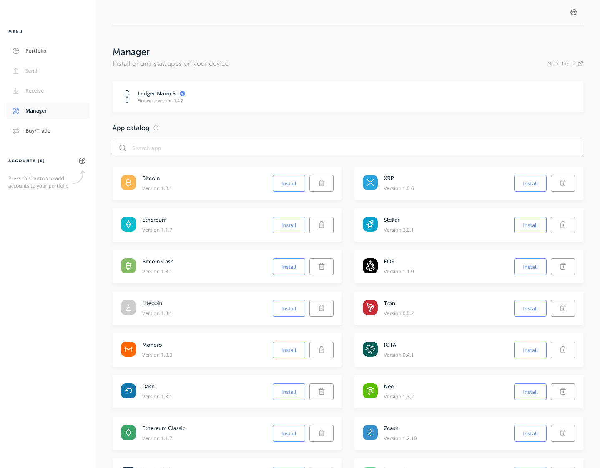

* Click the gear icon in the upper right corner to access Settings. Then click the toggle switch to enable "Developer mode".

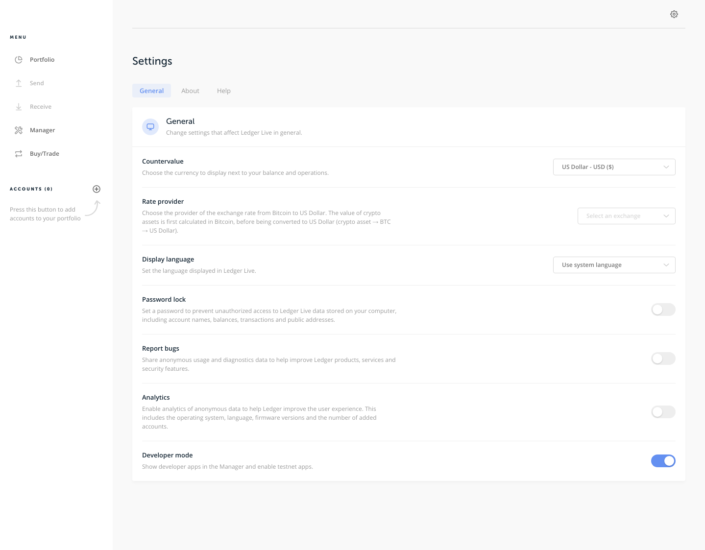

* Connect and unlock your Ledger Nano S. You may see a prompt on your Nano S to allow the manager on your device. Allow this by pressing the right button on the device.
* Search for Sia in the app catalog.

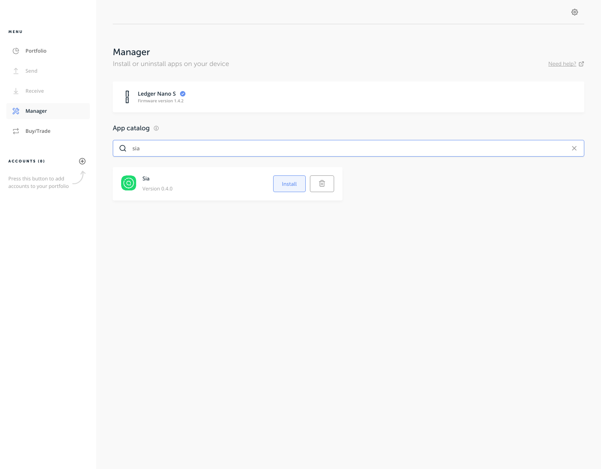

* Click the **Install** button. Your device will display **Processing...**

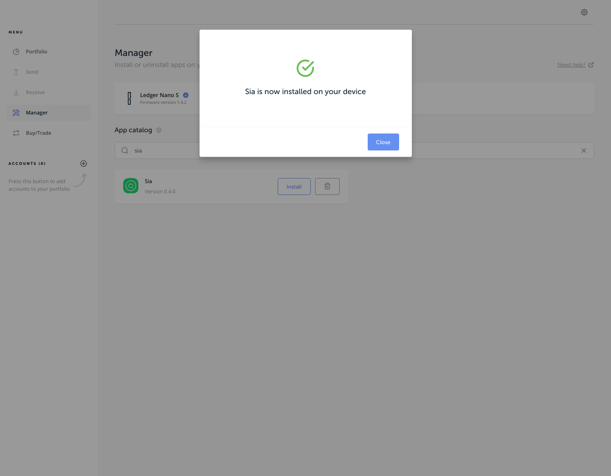

* When the main menu reappears, the Sia app has been successfully installed.

## Install siac and siad on your computer

_Unlike most Ledger Nano S apps, the Sia app requires a "full node." That means you'll need to download the Sia blockchain. If you've already downloaded the blockchain, you can skip this section._

**`siad`** – the Sia Daemon. This program connects to peers on the Sia network and downloads the blockchain.

**`siac`** – the Sia Client. This program issues commands to siad, such as instructing it to broadcast a transaction.

* Go to the [Sia downloads page](http://sia.tech/get-started).
* Use the Sia Daemon links on the right. This will download both `siac` and `siad` to your computer.
* Open a CLI window and navigate to the directory that contains `siac` and `siad`. Run the `./siad`command to begin downloading the blockchain to your computer.

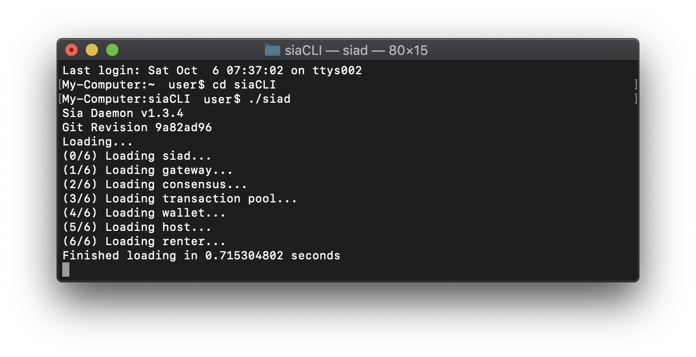

* Wait for the blockchain to finish downloading. You can monitor its progress by running `./siac` in another CLI window.

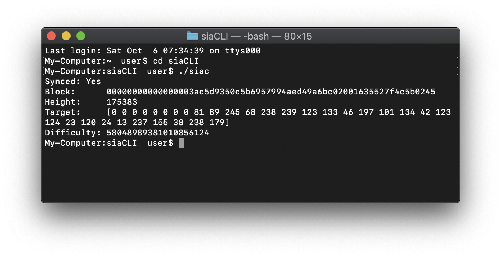

## Install the sialedger app

_sialedger is the command-line program you'll use on your computer to talk to the Sia app on your Nano S._

* Download `sialedger` [here](https://gitlab.com/NebulousLabs/nanos-app-sia/tags/v0.4.0).


Windows, macOS, and Linux are all supported.


* If you are on macOS, you may have to move sialedger to another folder \(such as Applications\) in order to run it.
* Open a CLI window and navigate to the directory that contains sialedger.
* Run `./sialedger` to confirm that the program works. It should print the current version.

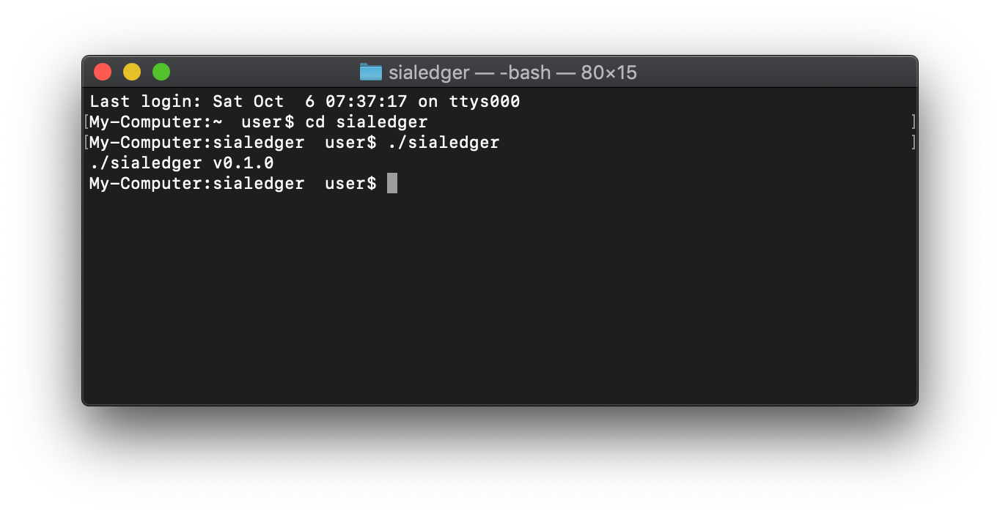

## Checking your wallet balance

_There's a handful of commands you can use to interact with your siac wallet, but first, you'll need to create and unlock your wallet._


The blockchain should be synced, or these commands will return errors.


`siac` Check the sync status of the Sia blockchain

`siac wallet init` Create a new wallet. This will immediately provide you with your seed. Your seed is very important. Normally, you would use this seed to generate your Sia addresses, but in this case you'll be using the seed on the Nano S instead. Still, you will need this seed to unlock your wallet in the future, so make sure to write it down somewhere safe.

`siac wallet unlock` Unlock your wallet.

## Receiving Siacoins using the Ledger Nano S

_Now that your CLI and Nano S are ready to go, let's generate an address._

* Open the Sia app from the main menu of your Nano S. It should display **Waiting for commands...**
* Run `./sialedger addr 0` from the CLI to generate key 0. You can generate other keys by specifying a different key index.
* Your Ledger Nano S will ask you to confirm the address generation for key index 0. Confirm by pressing the right button.

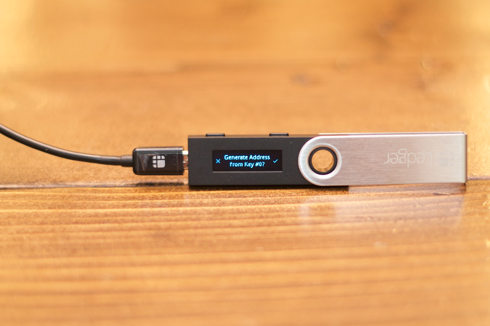


Make sure the key index on the Nano S matches the key index you requested. A compromised computer could trick you by sending a different key index to the device.


* The address will appear in the CLI and on the device screen. Compare these addresses to ensure that they match. You can use the left and right buttons on the Nano S to scroll through the address.

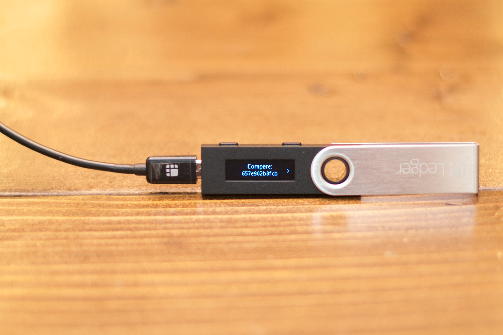

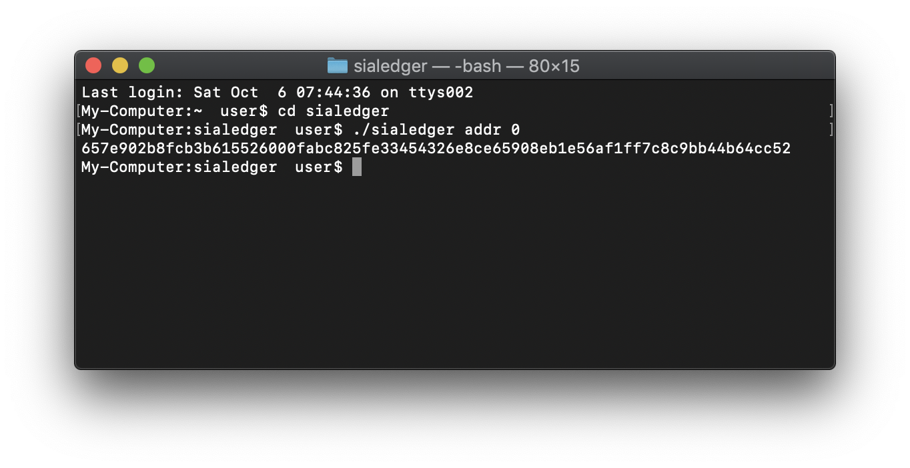


It is crucial that you verify every character in the address. A compromised computer could trick you by displaying a different address.


* Once you've verified the address, press both buttons to return to the main Sia app screen.

Your address is now ready to use! Send your existing siacoins to this address for safekeeping, or give this address to someone else to securely transfer coins to you.

## Sending Siacoins using the Ledger Nano S

Once you've received siacoins at an address generated by your Nano S, you can construct a transaction that spends those coins.

There are three main parts to a transaction:

1. You need an output to spend, for which you'll need that output's ID and the public key of the address that the output was sent to.
2. You need to specify how to split up the value of the output. Typically, a portion of the output is sent to your intended recipient \(such as a friend\), another portion is paid to the miner, and the rest is returned to you.
3. The transaction needs to be signed. Each output you spend needs a separate signature. We'll be using the Ledger Nano S to sign the transaction.

Start by collecting everything you need to construct the transaction:

* Identify an output to spend. You can find outputs by searching [https://explorer.siahub.info](https://explorer.siahub.info) for an address you generated on your Nano S. Make note of the Output ID field and its value.
* Generate the public key of the address that owns the output. To do so, run `./sialedger pubkey n`   \(where n is the same key index you used to generate the address\). Confirm the pubkey generation on the Nano S by pressing the right button.

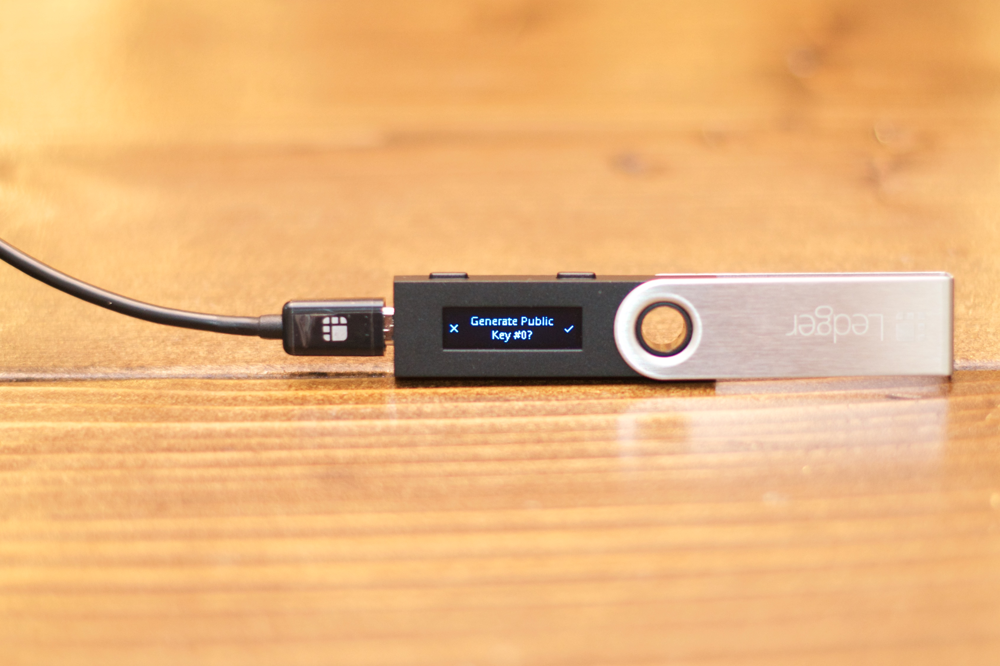

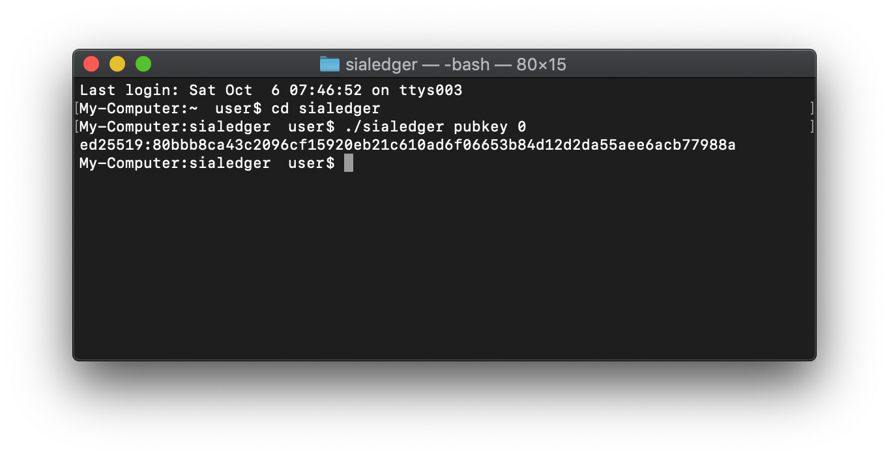

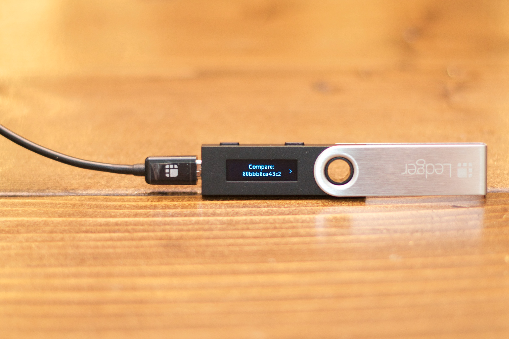

* Identify which address you want to send siacoins to.
* Choose a fee to pay to the miner.
* Generate a "return address" where you will receive the leftover portion of the output. Refer to [Receiving Siacoins](using-the-sia-ledger-nano-s-app.md#receiving-siacoins-using-the-ledger-nano-s) for how to do this.

## Building a transaction

_You are now ready to construct a transaction by substituting these values into the example below._

Note: the following are example values and may not match the values seen in earlier screenshots.

```go
{
  "siacoininputs": [{
    // The ID of the Siacoin Output that you are spending.
    // In this case, the output is worth 10 SC.
    "parentid": "48dcaacaf0ecb0ffce702b9115365e52b3cacc01ae87a70d8ca47349fbdc6831",
    "unlockconditions": {
      "signaturesrequired": 1,
      // The public key of the output.
      "publickeys": [ "ed25519:8b845bf4871bcdf4ff80478939e508f43a2d4b2f68e94e8b2e3d1ea9b5f33ef1" ]
    }
  }],
  "siacoinoutputs": [
    // The first output sends 5 SC to a friend.
    {
      // The address you are sending siacoins to.
      "unlockhash": "17d25299caeccaa7d1598751f239dd47570d148bb08658e596112d917dfa6bc8400b44f239b1",
      // The number of Hastings sent to this address.
      "value": "5000000000000000000000000"
    },
    // The second output returns 4 SC to you.
    {
      // This should be an address that you control.
      "unlockhash": "996b3fc7de889073b1fffcaa52c18c447cbcf4f6d7825e16e88b73d2ae1aa74cbd96f1f16991",
      "value": "4000000000000000000000000"
    }
  ],
  // The number of Hastings to pay to the miner (in this case, 1 SC).
  "minerfees": [ "1000000000000000000000000" ],
  "transactionsignatures": [{
    // The ID of the Siacoin Output that you are spending.
    "parentid": "48dcaacaf0ecb0ffce702b9115365e52b3cacc01ae87a70d8ca47349fbdc6831",
    "coveredfields": { "wholetransaction": true }
  }]
}
```

* Save this transaction to a file. We'll assume the file is named `txn.json`. Move it to the same directory as the `sialedger` app.
* Run `./sialedger txn txn.json 0 n`, where `n` is the same key index you used to generate the public key earlier.
* The Nano S will display each part of the transaction. Scroll with the left and right buttons, and proceed by pressing both buttons.
* Once you have reviewed each part of the transaction, you will be asked to confirm that you want to sign the transaction. Press the right button to confirm.

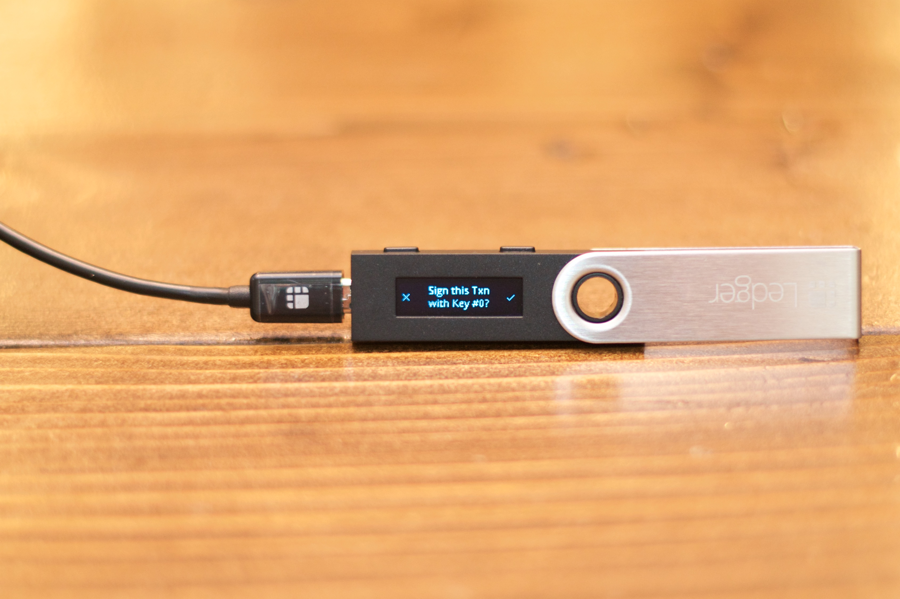

* The CLI will display the signature generated by the Nano S.

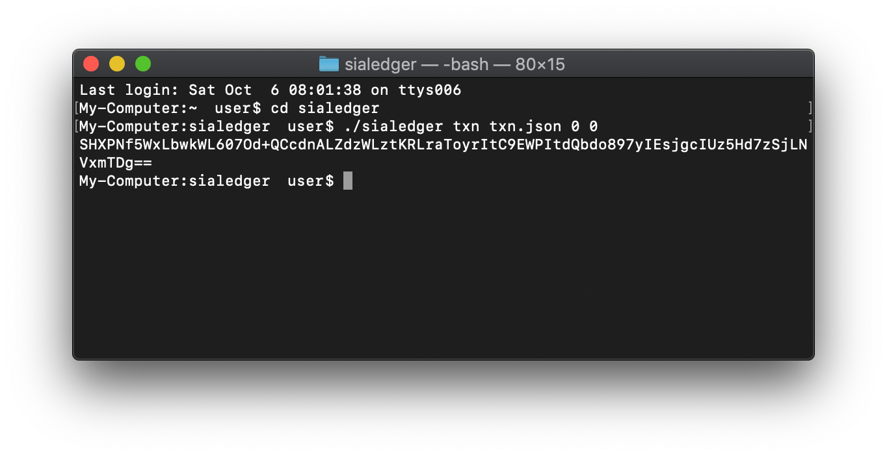

* Open the `txn.json` file and insert the signature near the end of the file, below `transactionsignatures` and above `parentid`:

```go
"transactionsignatures": [{
     // The new signature line goes right here.
     "signature": "SHXPNf5WxLbwkWL607Od+QCcdnALZdzWLztKRLraToyrItC9EWPItdQbdo897yIEsjgcIUz5Hd7zSjLNVxmTDg==",
     "parentid": "48dcaacaf0ecb0ffce702b9115365e52b3cacc01ae87a70d8ca47349fbdc6831",
     "coveredfields": { "wholetransaction": true }
   }]
```

The transaction is now valid. To broadcast it to the Sia network, simply move txn.json to the folder you run Sia commands from, and run:

`siac wallet broadcast txn.json`

## Get help

If you're having trouble, we're here to help. [Email our official support](mailto:hello@sia.tech), or [join our Discord server](https://discord.gg/sia) and post in the \#core-dev or \#app-dev channels.

