# Using the Sia Ledger Nano X app

## What is the Ledger Nano X?

The Nano X is a hardware wallet created by Ledger. A hardware wallet stores the private keys to cryptocurrency on a separate device, making it much harder for malicious parties to steal them. In fact, the private keys never leave the hardware wallet, so they will remain secure even if the device is connected to a compromised computer. As long as you follow best practices when using your hardware wallet, it is virtually impossible for an attacker to steal your funds.

Hardware wallets are an important part of the crypto ecosystem, and they're one of the best ways to personally secure your coins. We're happy to be working with Ledger to offer our official Sia app for use on the Ledger Nano X.

To send and receive Siacoin on the Ledger Nano X we will be using Sia Central's web wallet through the latest version of Google Chrome desktop. Sia Central's web wallet only supports Siacoin, sending and claiming Siafund dividends are not yet supported. The web wallet should always be accessed from https://wallet.siacentral.com.

## Things you'll need

Using Sia on the Ledger Nano X requires a few things. You will need:

* Your Ledger Nano X
* The Sia app installed on your Nano X
* A desktop browser to access Sia Central's web wallet

### Supported browsers
The web wallet only supports Ledger wallets on some desktop browsers:

||USB Suppport |Bluetooth Support|
--|--|--
Chrome | 89+ | 89+ (macOS and Windows only)
Microsoft Edge | 89+ | Not available
Opera | 76+ | Not available
Brave | 1.29.77+ | Not available
Safari | Not available | Not available
Firefox | Not available | Not available
Android | Not available | Not available
iOS | Not available | Not available

## Set up your Ledger Nano X

_Let's make sure your hardware wallet is ready to use._

1. [Initialize](https://support.ledger.com/hc/en-us/articles/360018784134-Set-up-your-Ledger-Nano-X) your Ledger Nano X. This gets the hardware wallet set up and ready to use.
2. Download [Ledger Live Desktop](https://support.ledger.com/hc/en-us/articles/4404389606417-Download-and-install-Ledger-Live) onto your computer. Ledger Live is the app you use to manage your Ledger device.
3. [Install the latest firmware](https://support.ledger.com/hc/en-us/articles/360013349800-Update-Ledger-Nano-X-firmware) on your Nano X. This ensures compatibility with the Sia app.

### Install the Sia Ledger Nano X app 

_Now we'll install the Sia app onto your Ledger hardware wallet._

1. Open the **Manager** in Ledger Live.

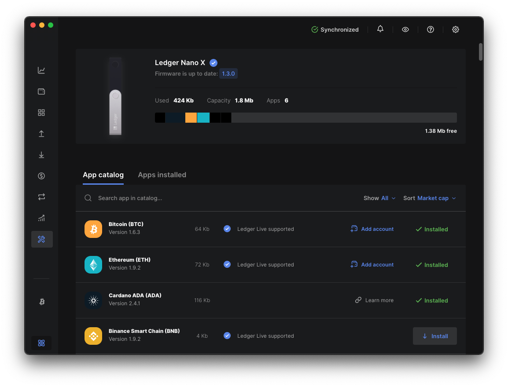

2. Connect and unlock your Ledger Nano X via USB. You will be prompted on your device to allow the manager.
3. Search for Sia in the app catalog.

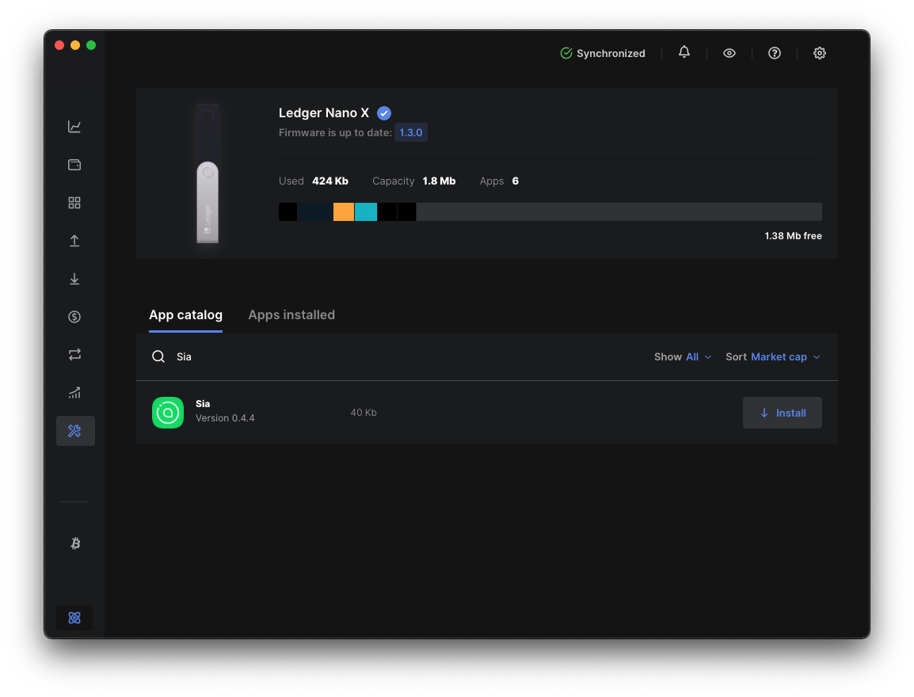

4. Click the **Install** button. Your device will display **Processing...**
5. When the main menu reappears, the Sia app has been successfully installed.

## Wallet Setup

Sia Central's web wallet is a lite, non-custodial wallet that allows you to send and receive Siacoin without downloading the blockchain. After the Ledger wallet is imported, your balance can be viewed almost immediately.

1. Access the wallet at https://wallet.siacentral.com
2. If you have never used the wallet before you will be prompted to set a password. This password is used to encrypt your data and is required to unlock your wallets in the future.

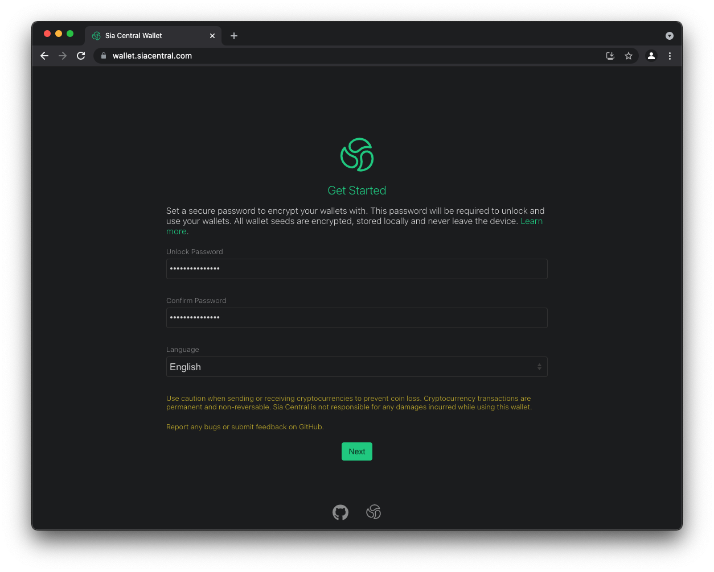

3. Create a new wallet

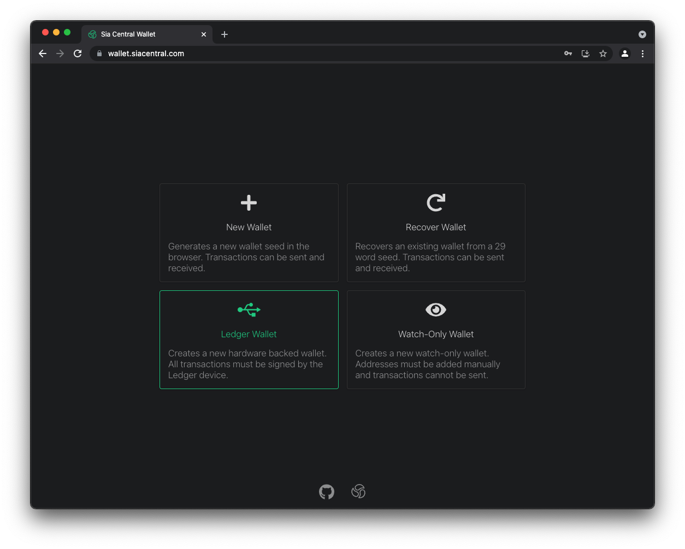

4. Click "Ledger Wallet" to add a new Ledger wallet.

You will now need to connect your device and import an address to send Siacoins to. When connecting you can choose either USB or Bluetooth depending on your browser's support.
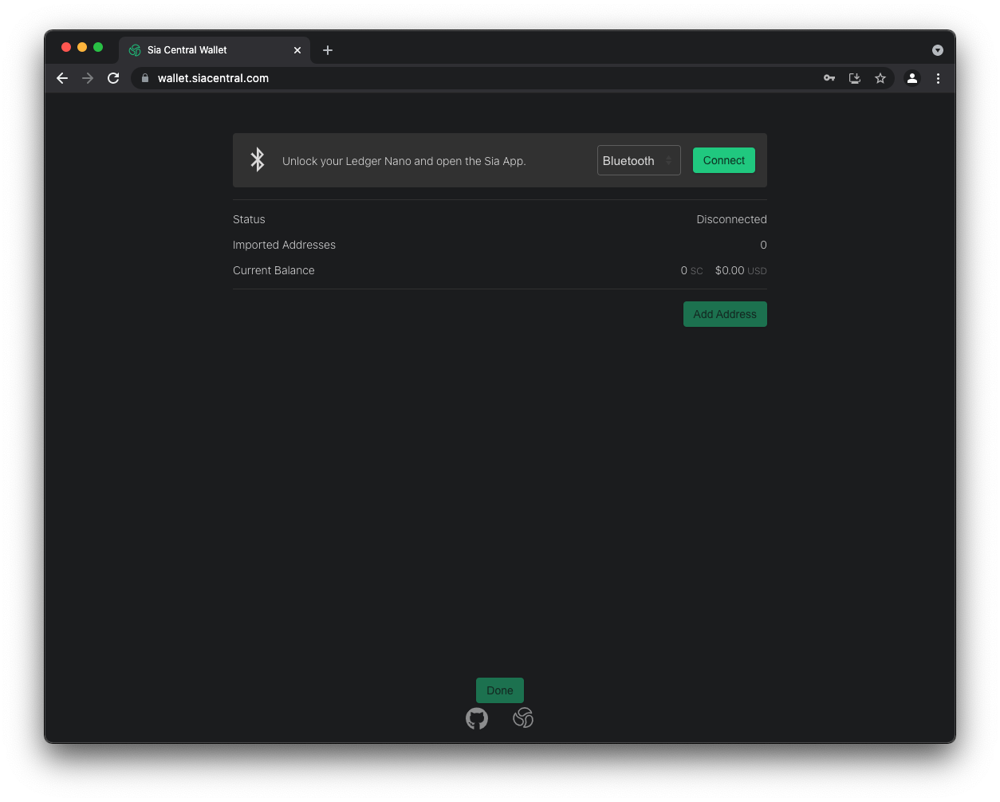

6. Connect and unlock your Ledger Nano X, then open the Sia app.
7. Click the green "Connect" button in the wallet. The status should change to "Connected".


If you have never connected your Ledger Nano X to this computer before, you may need to confirm the pairing on the device.


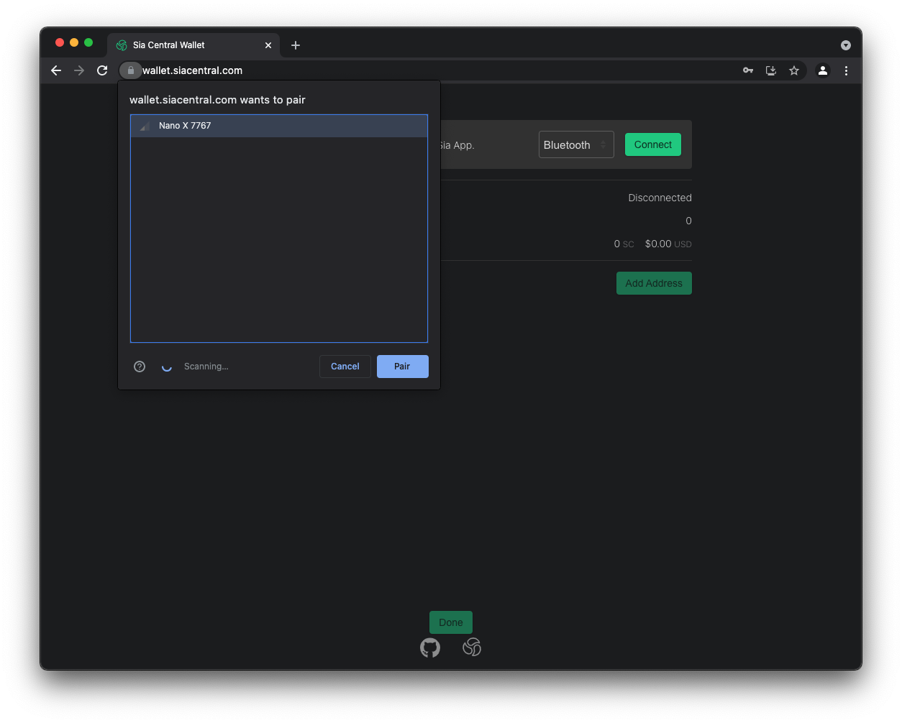

8. Click the "Add Address" button. Confirm that you want to generate the address on your device by pressing the right button once, the screen should now read "Approve"; then press both buttons together to confirm.

9. The address is now imported, verify that the address in the box matches the address displayed on the Ledger Nano X. If you have used this device before your balance will update. 

10. Optionally, you can add additional addresses by clicking the "Add Address" button again and confirming on the device.

11. After you have imported your addresses click the "Done" button at the bottom. You will now have a new wallet in your dashboard.

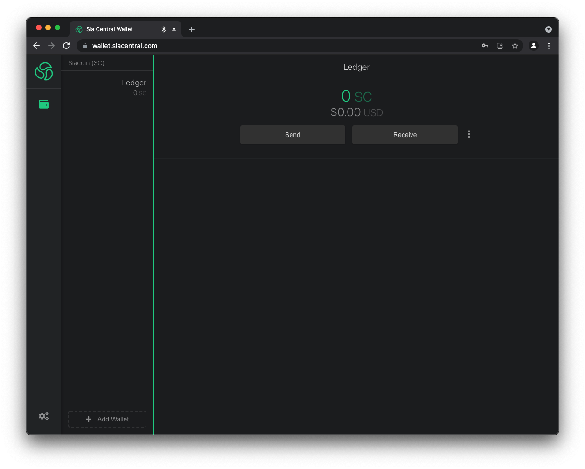

## Receiving Siacoin 

After the initial setup is complete you can send Siacoin to your wallet. Select your wallet from the list on the right, then click the "Receive" button right under the balance.

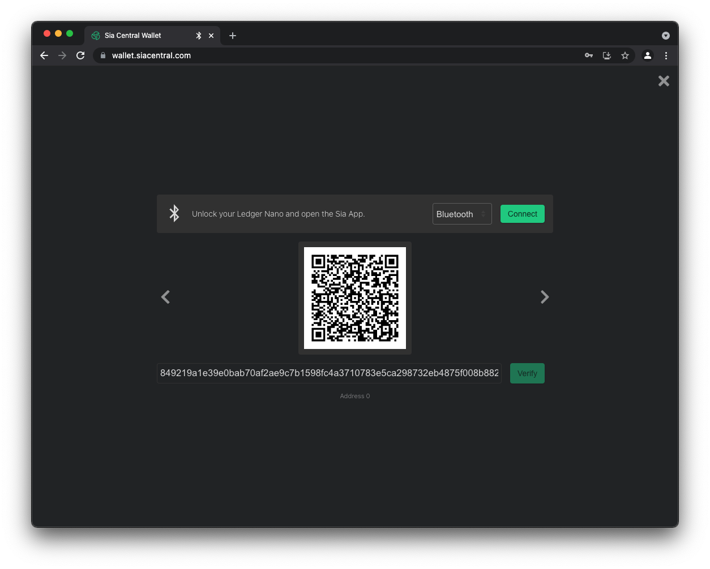

Before sending Siacoin to an address it is important to manually verify that it belongs to your wallet.

1. Connect your Ledger Nano X, unlock it, and open the Sia app.
2. Click the green "Connect" button above the QR code.
3. Click the green "Verify" button next to your address.
4. Confirm that you want to generate the address on your device.
5. Manually check that the address displayed on the device matches the address in the text box.

After verifying the address you can send Siacoin to this address. If this is the first time you have sent Siacoin to the Ledger Nano X, try with a small amount first to make sure everything is setup correctly. When you receive Siacoin it will be marked as an unconfirmed transaction for 10 minutes to an hour. You will have to wait for at least one confirmation before you can spend your Siacoin.

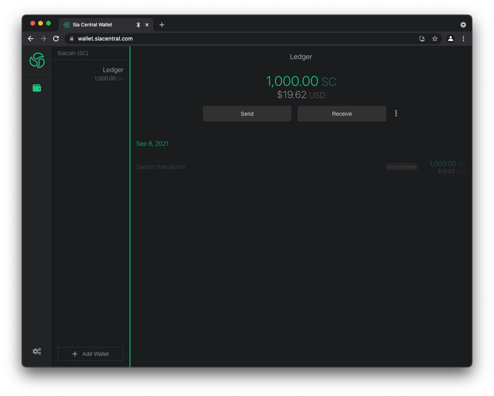

## Checking balance 

Your balance and your last 500 transactions can be displayed at any time by selecting the wallet from the list on the left of the dashboard. You do not need your Ledger to view your balance. Just to verify addresses or send transactions.

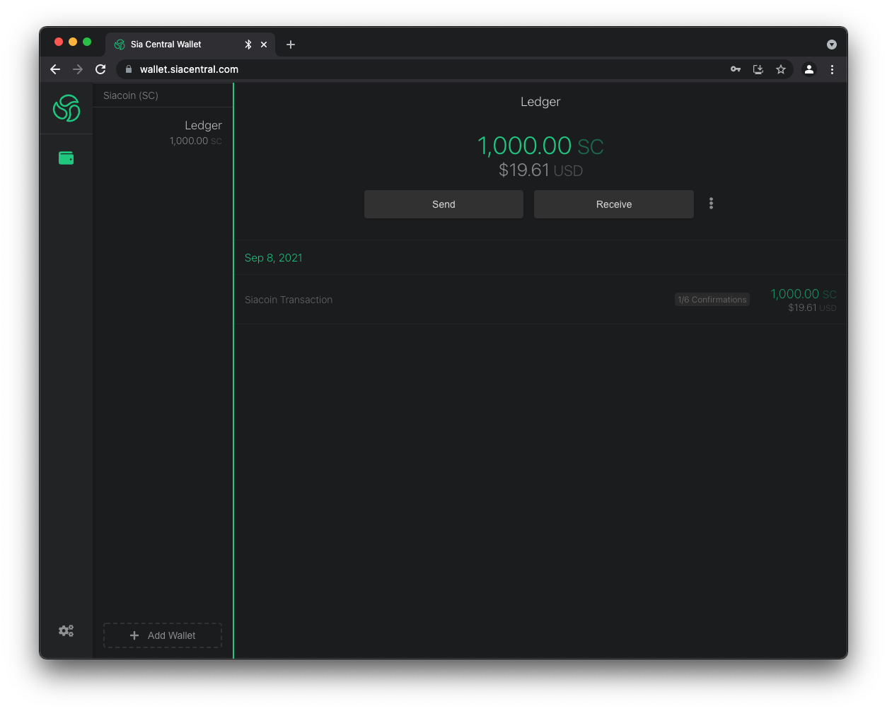

## Sending Siacoin 

To send a transaction you will need your Ledger Nano X. Select your wallet from the list on the left; then click "Send". A dialog will pop up allowing you to input the recipient's address and the amount of Siacoin to send them. You can enter the amount in your display currency, or Siacoin.

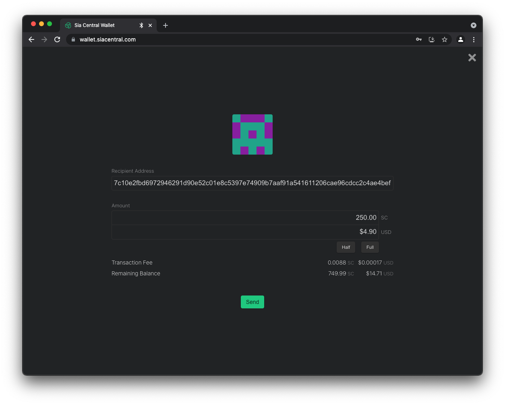

Once you have entered the address and amount, click the "Send" button. You will now need to verify the transaction and sign it with your Ledger Nano X.

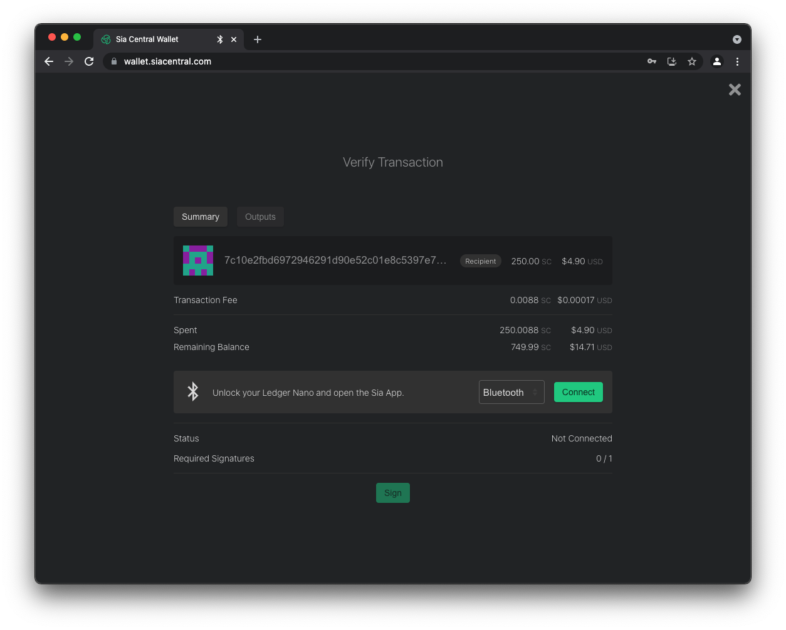

1. Connect your Ledger Nano X, unlock it, and open the Sia app.
2. Press the green "Connect" button; the "Sign" button should enable.

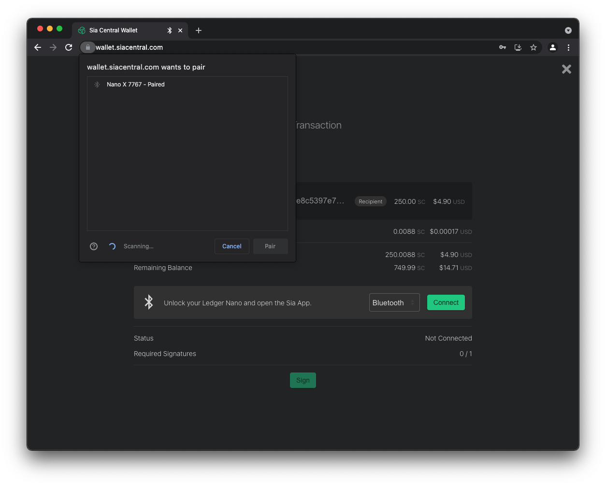

3. Click the green "Sign" button.
4. You will now need to confirm the transaction details on your device.

5. Verify that the "SC Output #1", displayed on your device, matches your intended recipient. To confirm on the device: scroll to page 2 by pressing the right button, then press both buttons at the same time.
6. Next the send amount will be displayed; verify it matches the amount you wish to send. Then confirm by pressing both buttons at the same time.
7. Verify that "Miner Fee #1" matches the amount displayed on the screen. Confirm by pressing both buttons at the same time.
8. After confirming the transaction details are correct, sign the transaction. Press the right button once; the device should now say "Approve". Press both buttons at the same time to confirm the signature.

9. In the lite wallet, the "Send" button should appear. To broadcast your transaction and send your Siacoin, press "Send". The amount will be deducted from your balance and sent to your recipient.

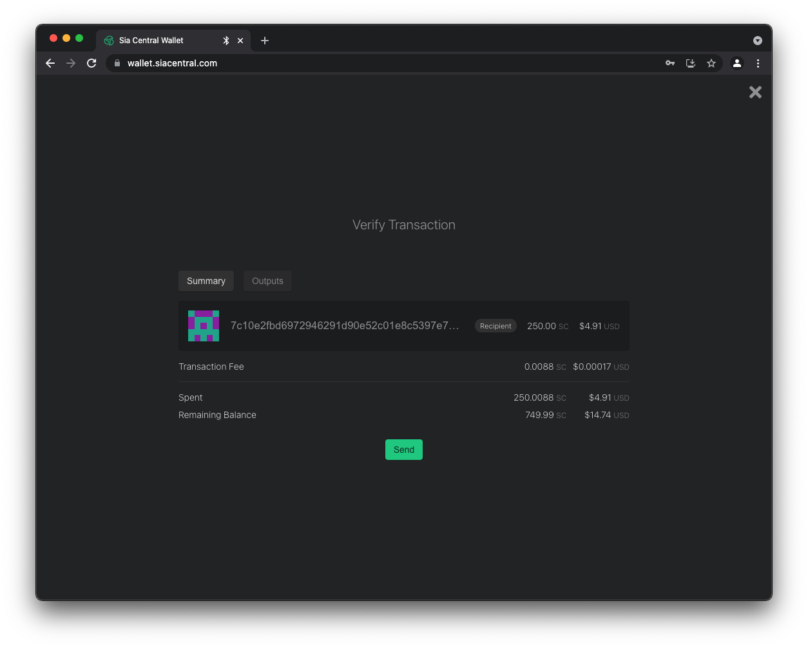

If the transaction broadcast successfully, you should now have a new unconfirmed transaction in your transaction list deducting the amount + the transaction fee. Your recipient will have to wait between 10 minutes to an hour for the transaction to be confirmed. Depending on how many UTXOs are in your wallet; you may have to wait for at least one confirmation before being able to send another transaction.

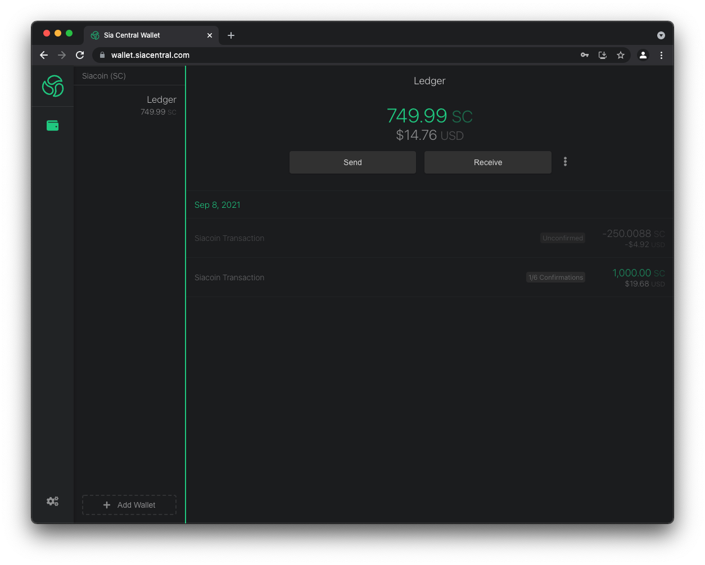

## Additional help

If you're having trouble, we're here to help. [Email our official support](mailto:hello@sia.tech), or [join our Discord server](https://discord.gg/sia) and post in the \#core-dev or \#app-dev channels.