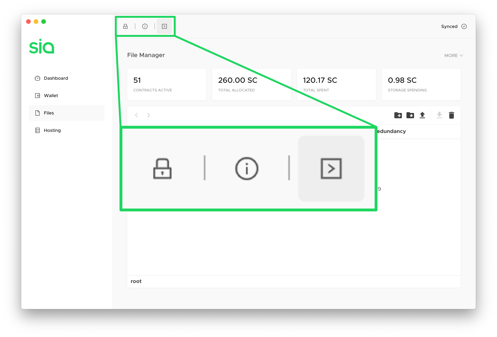
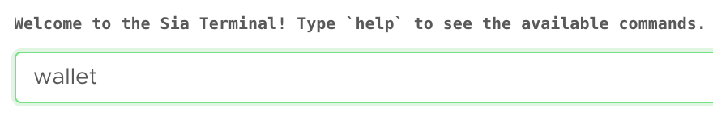
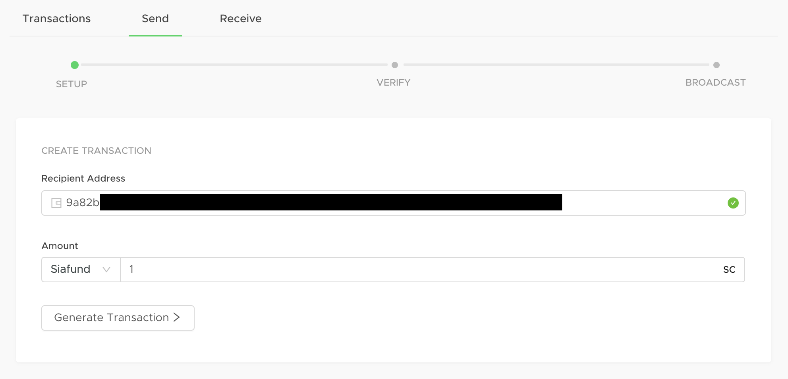
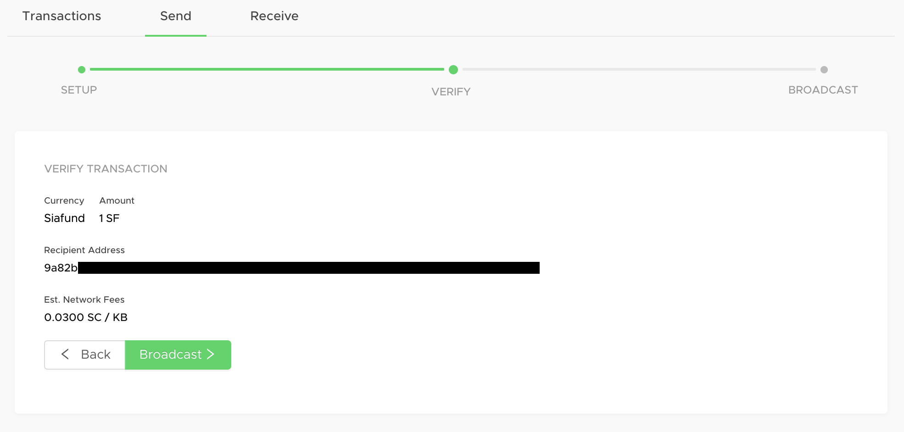
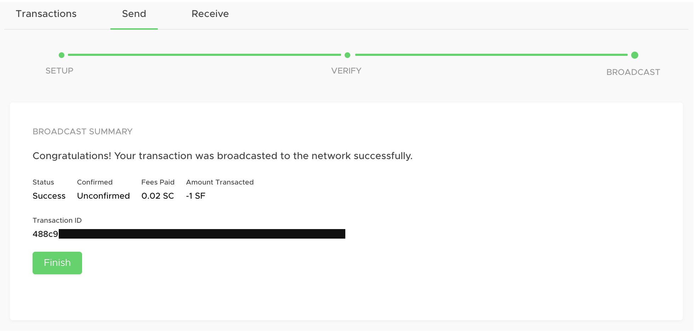

# How to cash out Siafunds

As Sia network usage increases, Siafunds will accrue Siacoins over time. [Learn more about Siafunds.](what-are-siafunds.md)

If you're a Siafund owner, you have the option of cashing out these accrued Siacoins at any point by sending your Siafunds to a Sia address you own. This can be the same wallet the Siafunds are currently in, or a different wallet you control.


You **do not** lose the Siafunds in this process. You'll always retain control over them unless you send them to someone else or a bad address.


## How many Siacoins has my Siafund earned?

Sia automatically keeps track of how many Siacoins your Siafunds have accrued, and we have an easy way to check that balance.

In any tab of Sia-UI, click on the Terminal button at the top. It's the third button, and looks like a right-facing arrow in a box: `>`

Type a single word command into the interface that pops up: `wallet`

You'll be presented with a recap of your wallet: how many Siacoins you have, how many Siafunds you have, and how many Siacoins your Siafunds have earned, listed as `Siafund Claims`.

## Generate a Sia address

Go to the Wallet tab of Sia, and click **Receive.**

Click **Generate New Address** to create a new Sia address.

Copy and paste this manually, or use the `Copy` button to the right to make sure you get the full address without any extra spaces.

## Send your Siafunds to this address

Now switch over to the Send section of your wallet.

Enter the wallet address and the amount of Siafunds you want to send. Make sure that you've entered a Sia wallet address you control, and that you've entered it correctly.


Siafunds sent to mistyped addresses cannot be retrieved.


Click **Generate Transaction.**

## Verify your info

Next, you need to verify everything. You'll have a chance to double-check the currency, amount, and recipient address. Sia-UI will also show you estimated network fees.

Click **Back** to change something. If it's all good, click **Broadcast.**

## Check the status

You'll immediately get a confirmation.

And you'll see a small tag appear under your balance to let you know the transaction is on its way but hasn't yet appeared in a block.

## For advanced users

If you're using siac, the process is the same. Just initiate a transaction and send your Siafunds to a wallet address you control. You can use this command:

`siac wallet send siafunds <amount> <destination address (must be your own)>`

to take the accrued Siacoins and put them in your wallet. The Siafunds will still be on your wallet because you sent them to your own address.

