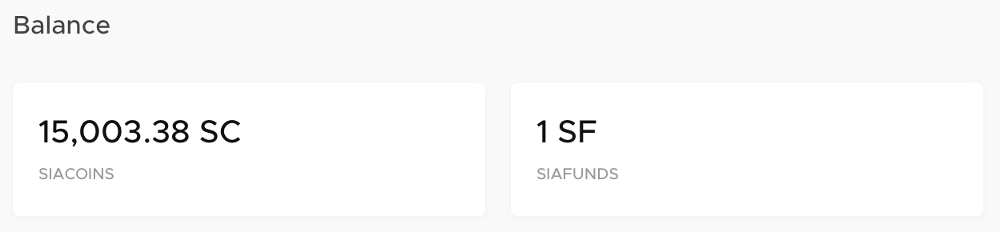

# What are Siafunds?

You know all about Siacoins, the utility token used for automatically fulfilling Sia's smart contracts. But what about Siafunds - the other token on the Sia network?

Siafunds are tokens used for revenue sharing on the Sia network; a 3.9% fee from every storage-related transaction on Sia is distributed to the holders of Siafunds. The Sia core team currently holds approximately 85% of all Siafunds.

When contracts are completed on the network, 3.9% of each funding source is reserved for Siafund holders. Funding sources for contracts are:

* Renter fees for storage
* Renter bandwidth costs
* Host collateral

At the end of a contract, the amount reserved is then dispersed to all Siafund holders equally.

## How to store Siafunds

Siafunds are stored in your wallet, right next to your Siacoins.

They are also sent to and received at normal Siacoin addresses, and can be restored with your Siacoin balance as long as you have your Sia seed.

## Why Siafunds?

We created Siafunds in order to sustainably fund the development of the Sia network.

We created Siafunds in order to sustainably fund the development of the Sia network. Siafunds incentivize and enable us – and investors – to maintain and improve the Sia network by capturing a share of revenue as the network grows. As more users pay for storage, Siafund revenues increase and more resources can be devoted toward Sia development.

## Tokenized securities vs utility tokens

We believe Siafunds are “tokenized securities” rather than “utility” tokens. Utility tokens primarily derive their value from use on a blockchain platform, like Siacoins. Siafunds, by contrast, derive their value from the present and future value of the Sia storage network.

## How many Siafunds are there?

The maximum number of Siafunds that will ever be issued is 10,000, all of which were generated upon the launch of the Sia software in 2015. Because the number of Siafunds issued is fixed, as the number, size, and value of the contracts on the Sia network increase, the amount of revenue per Siafund increases proportionally.

Nebulous, Inc. originally owned all 10,000, but over the years have conducted multiple Siafund sales to fund development. As of April 2019, Nebulous holds about 8,600, and the rest have been issues to third parties.

