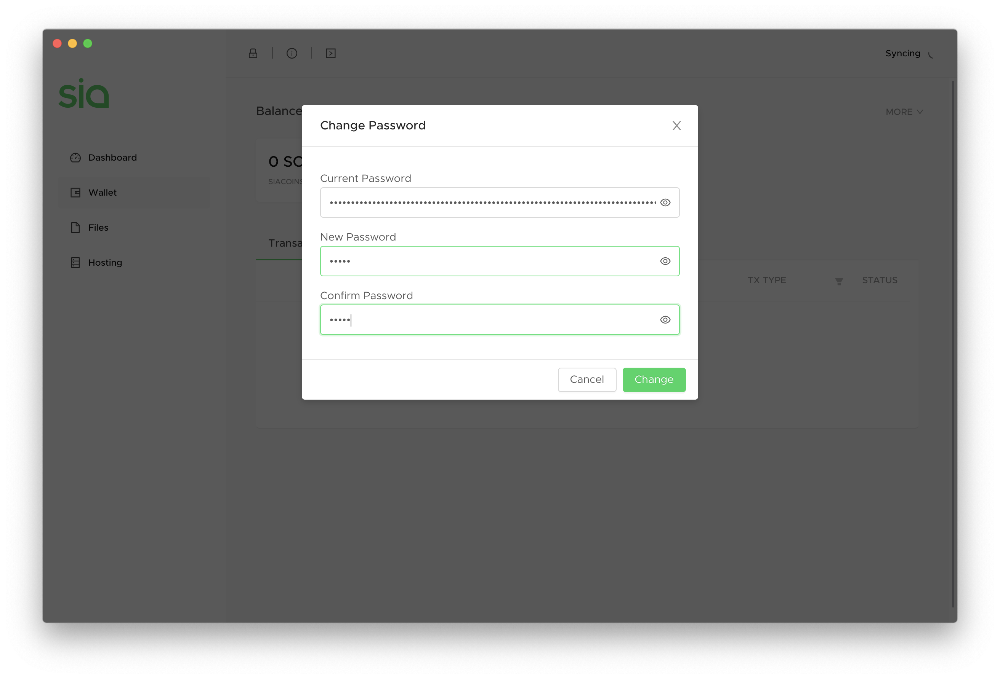

# How do I change my Sia wallet password?

## Your seed vs a custom password

By default, your 29 word Sia seed is your Sia-UI wallet password. But you can also set a custom password to unlock your wallet, and there are pros and cons to each. Let's take a look.


Even if you set a custom password, you still need to keep your seed safe. Learn about [the importance of your seed.](the-importance-of-your-seed.md)


## Things you'll need

Sia-UI, downloaded and installed. &lt;link&gt;

Your Sia-UI wallet set up. &lt;link&gt;

## Using a custom password

This means you set your wallet password to a totally custom phrase of any length.


**Advantages**

* You don’t have to type in a ton of words every time you want to unlock your wallet.
* It reduces the exposure of your seed. If keylogging software were to steal your custom password, there’s nothing they can do with it unless the person also has access to your computer.



**Disadvantage**

* It might make accessing your wallet easier for those who have physical or remote access to your computer.


## Using your seed as your password


**Advantages**

* Your seed is long. This offers great protection against someone trying to “brute force” your wallet open, or someone peeking over your shoulder as you type it.
* Since you'll be typing it in fairly often, you'll know it's correct.



Disadvantages

* Typing your seed in repeatedly makes you vulnerable to keylogging. Keylogging is when your keyboard input is recorded using malware or a physical device and then sent to a malicious party. If someone gets your seed, they can easily steal your Siacoins.
* Typing in 29 words every time you want to access your wallet might not be tolerable for you.


## Setting a custom password

Go to the Wallet tab in Sia-UI.

Click **More** in the upper right corner.

Click **Change Password.** Sia-UI will ask for your current password. For current password, enter whatever you're using to unlock your wallet now. You can then enter your custom password.

That's it! You've changed your Sia-UI password.

