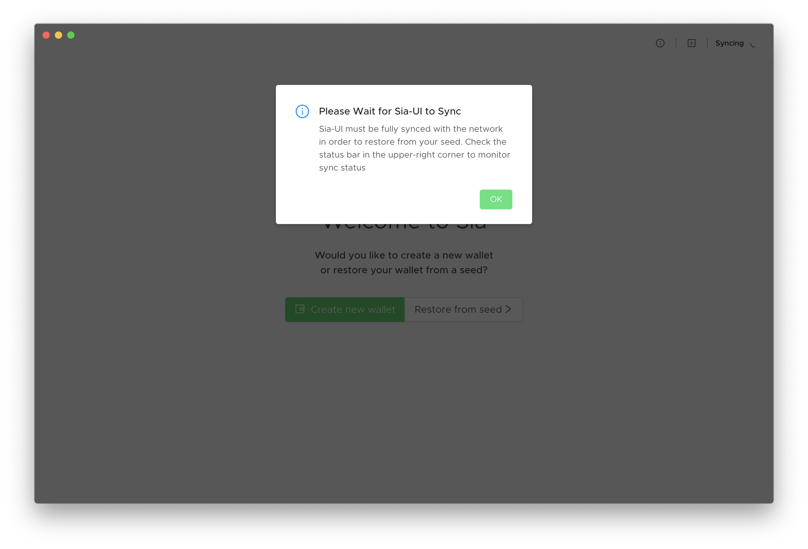
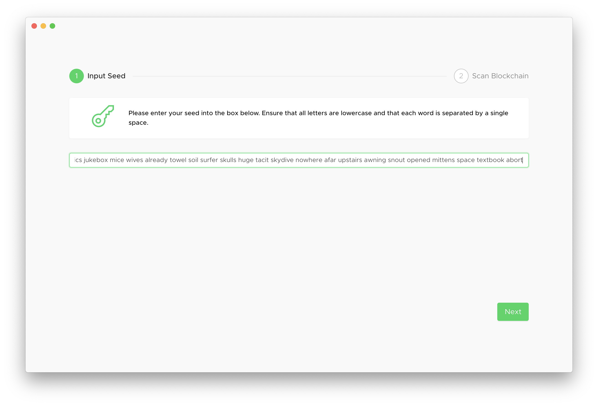
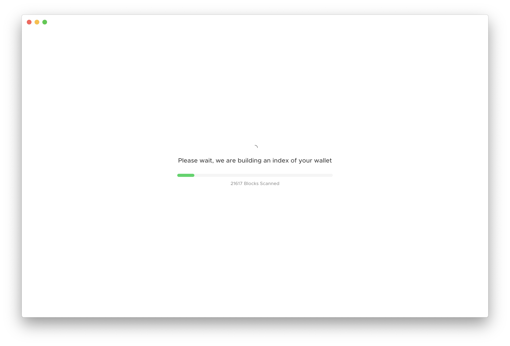

# How to restore a wallet from a seed in Sia-UI

If you already have a Sia seed with a balance of Siacoins, you can recover and use your Siacoins at any time by using Sia-UI on your computer.

## Things You'll Need

* A desktop or notebook computer with a decent amount of available storage space. As of January 2021, you need 24 GB for the Sia blockchain to download. This file will only get larger, so allocate some space to be able to grow with Sia.
* Your Sia seed.
* Sia-UI installed. [Don't have Sia-UI yet?](http://sia.tech/get-started)
* The Sia blockchain fully synced to Sia-UI. Syncing can take hours on an SSD, and days on a traditional HDD.

## Restore from a seed


Restoring from your seed does not restore a custom password. After following this process, you'll use your Sia seed to log in to your wallet until you [set a custom password.](../how-do-i-change-my-sia-wallet-password.md)


Go to the Wallet tab. If there's not another wallet setup already, you'll see two options: Create new wallet and Restore from seed. Click **Restore from seed.**

If the blockchain isn't fully synched, you'll receive a message telling you to wait. Sia-UI needs to be fully synced because it needs to scan the blockchain for all your transactions.

Once the blockchain is synced, clicking Restore from seed will prompt you for your Sia seed. It must be entered exactly as it was given to you: all lower-case letters, a space between each word, and no spaces at the beginning or end of the phrase. Enter your seed and then click **Next.**

NoteTipWarningThe text you enter here is readable on the screen, not disguised as bullets. Be sure no one is looking over your shoulder.

Sia-UI will then scan the blockchain.

Give Sia a few minutes, it needs to do some work on your wallet.

After it's done, you'll be taken to the Dashboard. Click back to the Wallet tab to find your balance.


After restoring Sia from your seed and resyncing, it might take your balance up to an hour to re-appear in the wallet as Sia performs more actions in the background.


That's it! Sia's so smart, it even pulls your transaction history.

