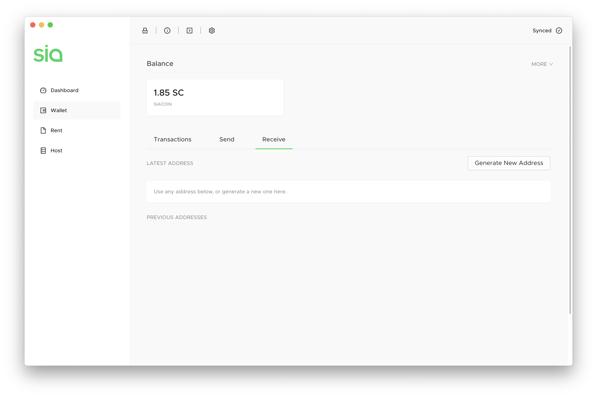
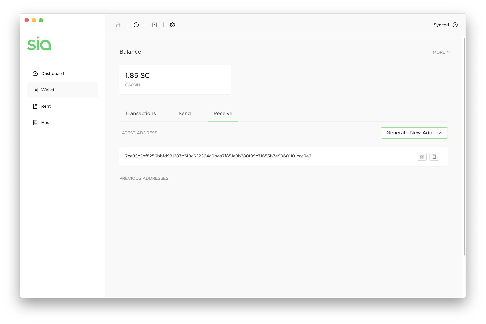
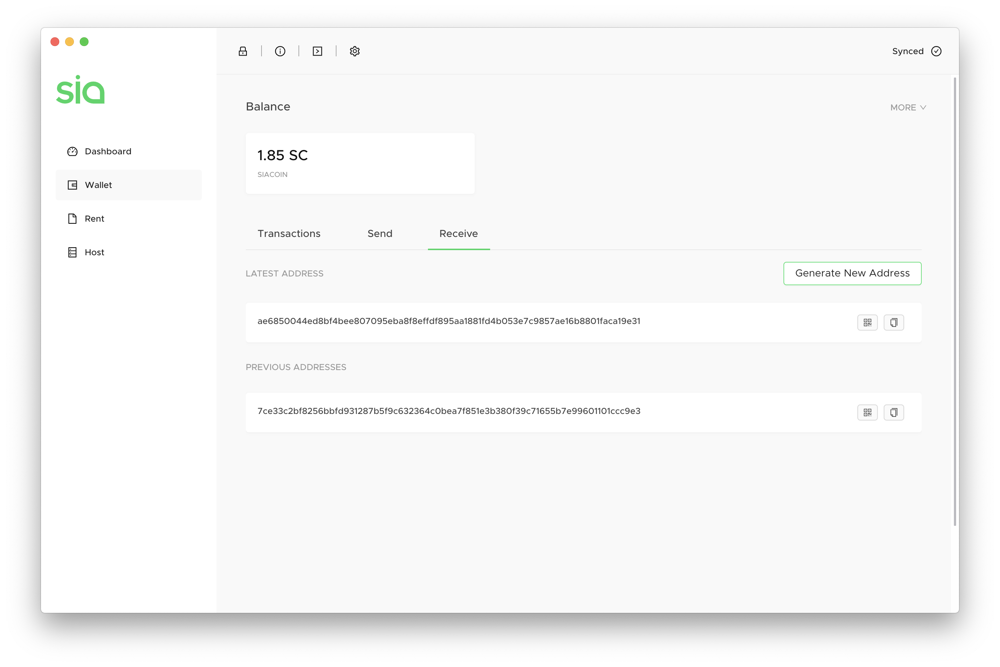

# How to make a Sia address

At some point, you'll need to receive Siacoins. You might be sending them over from an exchange wallet, another Sia wallet you own, or requesting Siacoins from a friend. No matter the reason, it's easy to generate an address in your Sia-UI wallet to receive Siacoins.


You can also receive [Siafunds](../../get-started-with-sia/frequently-asked-questions/siafunds/what-are-siafunds.md) using one of these addresses. Siacoins **and** Siafunds can be sent to any address generated by Sia.


Go to the Wallet in Sia-UI. Click on the **Receive** tab.

Click **Generate New Address** to create a new Siacoin address.

Copy and paste this manually, or use the **Copy** button to the right to make sure you get the full address without any extra spaces.

Clicking **Generate New Address** again will move the Latest Address down a step, and create a brand new Siacoin address for you to use.

Once you receive Siacoins, you'll see a history in the **Transactions** tab. You'll see 0/6, then 1/6, and so on. This indicates how many blocks have passed since the transaction has been processed. At six confirmations, we deem the transaction to be fully confirmed and will show a green checkmark.

 (2) (2) (1).png>)
