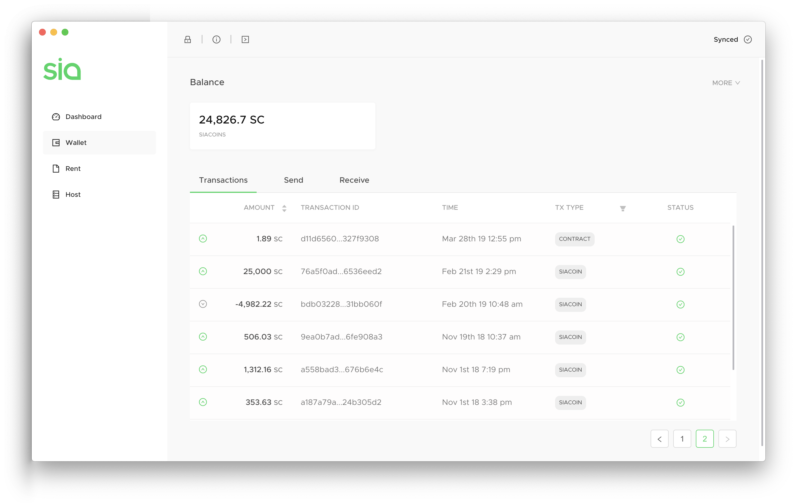
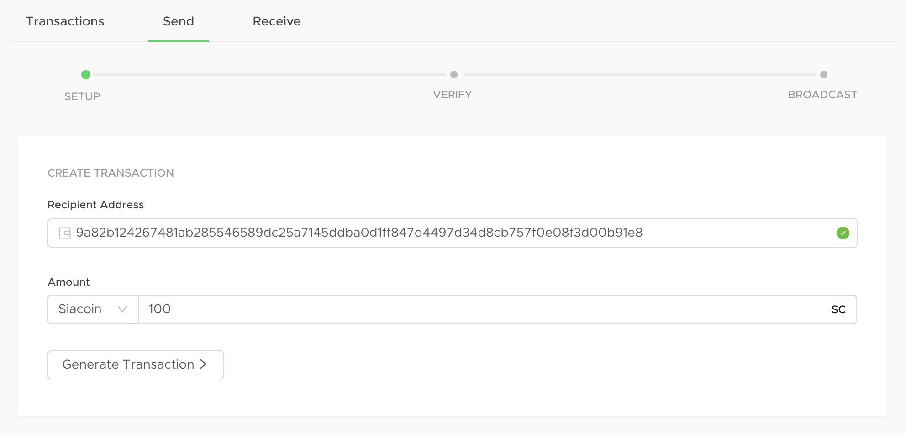
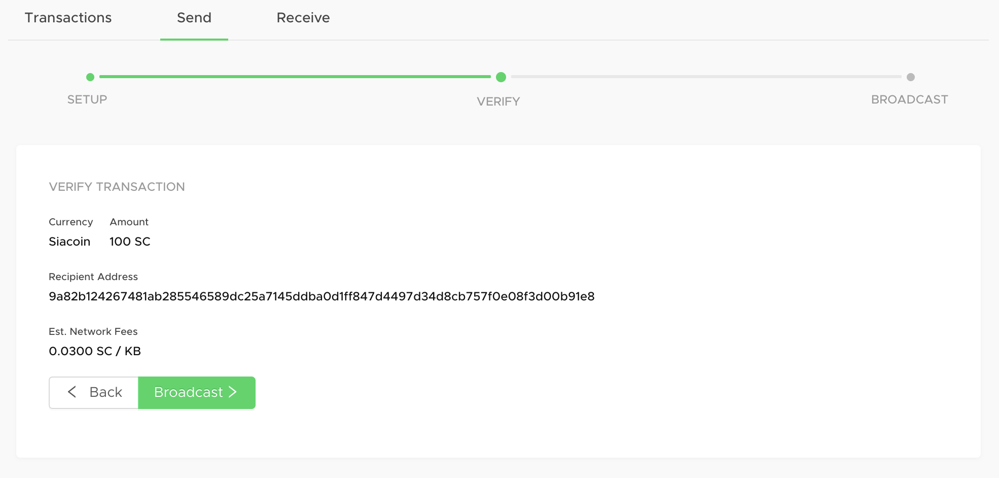
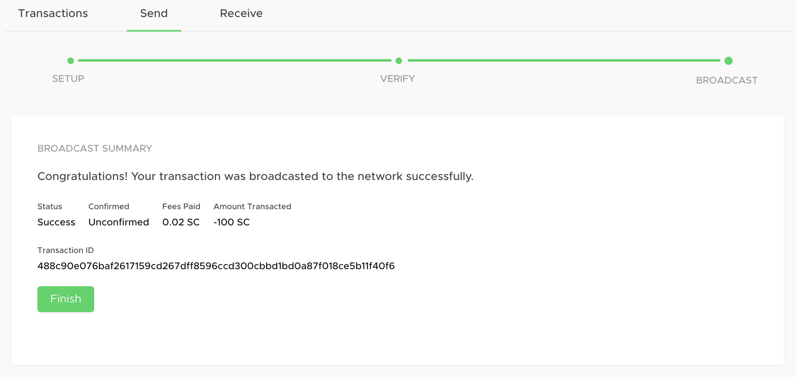
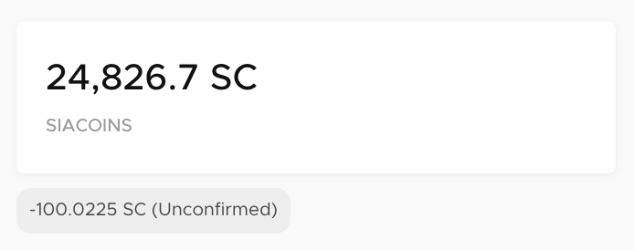
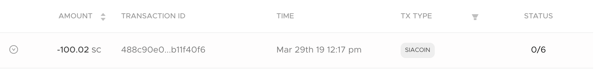
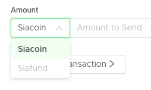

# How to send Siacoins

Whether you're sending Siacoins to an exchange or a friend, it's easy and can be done right from the app.

Go to the Wallet in Sia-UI. If you're asked to unlock the wallet, use either your seed or a custom password if you've set one.

## Setup your transaction

Click on the `Send` tab. Enter the recipient's wallet address and the amount of Siacoins you want to send. Make sure that you've entered a Siacoin wallet address, and that you've entered it correctly.


Siacoins sent to mistyped addresses, or addresses of other types of cryptocurrency can not be retrieved.


Click **Generate Transaction.**

## Verify your info

Next, you need to verify everything. You'll have a chance to double-check the currency, amount, and recipient address. Sia-UI will also show you estimated network fees.

Click back to change something. If it's all good, click **Broadcast.**

## Check the status

You'll immediately get a confirmation.

And you'll see a small tag appear under your balance to let you know the transaction is on its way, but hasn't yet appeared in a block.

Once it's in a block, you can go back to your Transactions history to see its status.


It might take a minute or two for the transaction to pop up in the Transactions list.


## Did you know?

You can also send Siafunds by using the dropdown next to Siacoin. This option won't be selectable unless you also have some in your wallet. [Learn about Siafunds.](../../siafunds/what-are-siafunds.md)

